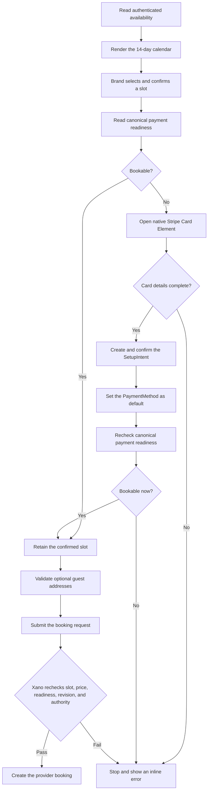

# V3 browser scripts

## Opportunity-alert email preferences

`opp-alerts-unsubscribe.js` binds the native Webflow content on the V3
opportunity-alert unsubscribe page. Keep the visible page structure in Webflow
and load one deferred controller:

```html
<script
  defer
  src="https://cdn.jsdelivr.net/gh/the-starters/starters-webflow@latest/v3/opp-alerts-unsubscribe.js"
></script>
```

The page root must use `id="oa-unsub"`. Inside that root, author one element for
each controller role:

- `data-oa="intro"` for the initial explanation;
- `data-oa="unsub"` for the **Unsubscribe me** button;
- `data-oa="resub"` for the initially hidden **Re-subscribe** button; and
- `data-oa="status"` for the initially hidden result or retry message.

The email link supplies the Memberstack member ID as the `m` query parameter.
If `m` is absent, the controller hides the unsubscribe button and tells the
member to use the link from their email. It sends no request during page load.
Only an explicit button click posts to the existing Xano
`notifications/unsubscribe` endpoint, with exactly these JSON fields:

```json
{
  "memberstack_id": "<value from m>",
  "resubscribe": false
}
```

The unsubscribe button sends `resubscribe: false`; after success, it hides the
intro and unsubscribe button, shows the success message, and reveals the
re-subscribe button. The re-subscribe button sends `resubscribe: true` and, on
success, confirms that opportunity alerts are active again. A failed request
restores the clicked button for retry and shows the authored status element with
`data-state="err"`; success uses `data-state="ok"`. The controller does not
read credentials, add authorization headers, or change any V2 page or script.

Run its focused static check and test with:

```sh
node --check v3/opp-alerts-unsubscribe.js
node --test v3/opp-alerts-unsubscribe.test.js
```

## Shared password recovery

`password-recovery.js` consolidates the Brand and Talent password-recovery
routes onto one canonical Memberstack flow:

```text
/forgot-password -> /reset-password -> /password-success
```

Install it once in the V3 site head, before Memberstack form initialization:

```html
<script
  defer
  src="https://cdn.jsdelivr.net/gh/the-starters/starters-webflow@latest/v3/password-recovery.js"
></script>
```

The module is inert outside the V3 staging hostname and production domains. It
owns these compatibility redirects while preserving the original query string,
reset token, encoding, and hash:

| legacy path                  | canonical path      | origin |
| ---------------------------- | ------------------- | ------ |
| `/starters-forgot-password`  | `/forgot-password`  | Talent |
| `/starters-reset-password`   | `/reset-password`   | Talent |
| `/starters-password-success` | `/password-success` | Talent |
| `/starter-password-success`  | `/password-success` | Talent |
| `/password-sucess`           | `/password-success` | Brand  |

The login pages should link to `/forgot-password?from=brand` and
`/forgot-password?from=talent`. On the canonical recovery pages, author both
login choices as native Webflow links:

```html
<a href="/login" data-password-recovery-login="brand">Brand login</a>
<a href="/starter-login" data-password-recovery-login="talent">Talent login</a>
```

When origin is known, the other choice is hidden. When a reset email is opened
without origin context, both remain visible. Add
`data-password-recovery-retry` to any native “Different email?” link. The live
Reset Password control is a Button component whose Link already points at
Forgot Password; component instances cannot take that attribute, so retry
matches the published `/forgot-password` href. Mark the authored “an email”
copy on Reset Password with `data-password-recovery-email` so a Recovery Email
Hint (the address submitted on Forgot Password in this tab) can fill that copy;
missing hint leaves the generic text and Reset Password still works. The module
updates existing forms through their canonical Memberstack attributes; it never
generates form or link markup. Do not add `data-ms-member="email"` on Reset
Password for this reminder.

Until both native login choices are present, a direct visit with no origin uses
the neutral homepage fallback instead of silently favoring Brand or Talent. The
fallback points the link at `/` and sets an `aria-label` of `Return to
homepage`. On a Webflow native button (an anchor inside `.button_main-wrap`) it
rewrites the sibling `.button_main-text` label so the visible text changes
without inserting overlapping overlay text; otherwise it updates the link's own
text.

Run its focused tests with:

```sh
node --test v3/password-recovery.test.js
```

## Login router

`auth-route.js` owns post-login and post-signup routing for V3 without changing
the shared Memberstack plan redirects used by V2. Install it only on the V3
`/login`, `/starter-login`, and `/auth-route` pages, after the sitewide
`route-guard.js` that owns the shared stable plan-role contract. It runs on the
V3 Webflow staging hostname and both custom domains; see
[AUTH-ROUTE-WIRING.md](AUTH-ROUTE-WIRING.md) for the
installation, error contract, and release gate. The versioned
[V3 Member Access Matrix](ACCESS-MATRIX.md) maps stable plan IDs to roles and
documents route access plus the separate Webflow, content, and Xano enforcement
layers.

The V3 opportunity and Messages guards send logged-out visitors to
`/login?next=<encoded current path and query>` so the router can restore an
allowed destination after login.

Talent logins additionally fork on funnel position, read from Xano
`starters_onboarding/get_build_profile_status`: `build_profile_done` false goes to
`/build-profile/select-profile`, true with `onboarding_done` not `true` goes to
`/starter-onboarding` (winning over any stored `next`), and both true routes
normally. Brand and unmapped members never trigger that call, and every
inconclusive answer fails open to the standard destination. The signal became
stricter on 2026-08-04; see [AUTH-ROUTE-WIRING.md](AUTH-ROUTE-WIRING.md) for the
endpoint contract and the 282-row reason.

Paid Brands take a parallel check through
`starters_onboarding/get_brand_profile_status`: `has_record` true with
`brand_profile_done` false goes to `/complete-profile`, winning over a stored
`next`. A non-empty `thestarters:v3-brand-profile-completed` marker short-circuits
as complete without a network call. `brand-free` and unmapped members stay
zero-network. The same eight-second budget and fail-open rule apply.
`/complete-profile` is not an allowed client-supplied `next`; the router constructs
that destination. See [AUTH-ROUTE-WIRING.md](AUTH-ROUTE-WIRING.md) for the endpoint
contract.

## Talent applications admin

`../code-components/` contains the parked, preparation-only React **Talent
Applications Admin** Code Component. It reviews the Xano-canonical V3 application
queue, loads application details and audit events, and submits notes, interview
links, and guarded status transitions with optimistic concurrency. It has no
Airtable, Make, or Zapier integration and does not replace or modify existing
Admin Ops, Marketing Ops, or V2 application workflows.

The Webflow registration exposes only the dashboard title and login URL, leaving
the component on its `Staging` API default. This foundation is not production-ready:
it has not been imported into Webflow or published on a page, and it must not be
tagged or deployed through jsDelivr before a separate cutover review. Memberstack
supplies the browser session, the shared trade-token endpoint returns a Xano token,
and the Xano
`admin/session` plus application endpoints remain the staff authorization and
data boundary. The browser's transition map is not an authorization control.

See [`../code-components/README.md`](../code-components/README.md) for package
commands, Designer properties, endpoint payloads, pagination behavior, status
transitions, security requirements, and the production-cutover constraint.

## Talent application intake

Two GitHub assets split the page's existing responsibilities without changing
the native Webflow form markup. `talent-application-ui.js` replaces the 23 KB
Webflow Code Embed and owns field validation, the conditional profile and
referral blocks, location loading, and custom-select behavior.
`talent-application.js` remains the only submission owner and canonical Xano
writer. The UI controller does not bind a submit handler, build a submission
payload, or log applicant fields.

Videsigns' multistep library calls jQuery's
synthetic `form.submit()` from its final "Complete" click handler, so a native
`submit` capture listener never sees that event. The script therefore listens
in capture phase two ways: a `click` listener on the multistep submit control
(`[data-form="submit-btn"], [data-form-ms="submit-btn"]`) intercepts the final
click before the library can fall through to Webflow's native form API, and a
`submit` listener still catches real native submits such as pressing Enter. Both
run before Webflow's delegated submit handler. It deliberately suppresses the
native Webflow submission because Zapier is no longer the application intake
path, then selects the Xano intake route from the exact browser host:

| Browser host | Xano route | Data environment |
| --- | --- | --- |
| `the-starters-3-0.webflow.io` | `talent/application/create-test` | TEST |
| `thestarters.com` | `talent/application/create` | LIVE |
| `www.thestarters.com` | `talent/application/create` | LIVE |

An unknown host fails closed before a request starts. Browser input cannot
select or override the route. Xano owns the authoritative application row and
mirrors it to the Airtable review table server-side.

Native constraint validation is preserved before the script takes ownership of
the submit: it calls `reportValidity` on the first invalid control, but only for
visible controls, so required-but-hidden Webflow fields (the non-selected
consult/full-profile pair, inactive steps) cannot silently block Complete with
an unshowable error. When a visible field is invalid the submission is aborted
and the native validation UI is shown.

The GitHub-backed source can be merged, tagged, and served through jsDelivr
before the Xano routes are ready. Do not install this browser change in Webflow
or run a canary until the Xano TEST route exists and the Talent application data
model enforces its `data_environment` partition. Staging must never fall back
to the LIVE route or LIVE data. After those prerequisites pass, replace the
full legacy inline Code Embed with the UI loader below. Install both scripts on
step 1 only, in this order:

```html
<script defer src="https://cdn.jsdelivr.net/gh/the-starters/starters-webflow@latest/v3/talent-application-ui.js"></script>
<script defer src="https://cdn.jsdelivr.net/gh/the-starters/starters-webflow@latest/v3/talent-application.js"></script>
```

Do not keep the legacy inline controller after this cutover. Both loaders are
deferred and must remain in the order shown.

Webflow contract:

- Keep `application-form` on the form itself:
  `<form application-form>`. Generated IDs and styling classes are not selector
  fallbacks.
- Keep the existing `[form-next]` and `[form-submit]` controls, profile radios,
  field IDs, and `[data-element]` conditional blocks. The UI controller binds
  the authored elements and does not generate the form markup.
- Keep the existing `country`, `state`, and `city` selects. The UI controller
  populates them from the published locations asset and adds the searchable
  custom-select presentation beside each native select.
- Author the optional marketing consent as a native Webflow checkbox named
  `marketing-email-consent`. It must be unchecked by default and use this exact
  label: “Send me hiring tips, expert recommendations, and product updates from
  The Starters by email. I can unsubscribe at any time.” JavaScript reads the
  installed checkbox but does not generate its HTML.
- Keep the multistep Complete control's `data-form="submit-btn"` (or
  `data-form-ms="submit-btn"`) attribute. The capture-phase click listener keys
  off it to intercept the final step before the multistep library submits.
- Keep the form inside its `.w-form` wrapper with a `.w-form-fail` block. A
  submit stopped by native constraint validation, or a failed request, reveals
  that block with only the authored user-facing error. A failed request also
  re-enables the submit control for retry. The shared receipt allowlist and
  console-only diagnostics are documented in
  [`../README.md`](../README.md#current-scripts).
- Set the form's `data-redirect` to `/freelancer-application/step-2`. The
  script also accepts `redirect` and otherwise defaults to that path.
- Remove any other custom submit interceptor from this form. The native
  Webflow/Zapier submission is intentionally not allowed to run.

The request maps the form's `email`, `first-name`, `last-name`, `phone`,
`linkedin`, `profile-type`, `function`, `referral-source`, `country`, and
`city` fields to the Xano intake contract. It selects `consult-option` and
`rate-consult` for a `Consult Only` profile; otherwise it selects
`role-option` and `rate`, with the other pair retained as a fallback. All
string form fields are also sent in `answers`; repeated field names are joined
in submission order, and non-string values such as file objects are ignored.
Because the runtime-built `country` and `state` selects store numeric option
indexes, the request resolves the selected `country`, `state`, and `city`
options to their visible text. The top-level `country` and `city` fields and
their entries in `answers` use that text; `state` is recorded in `answers`.
Empty placeholder options do not override the raw empty form values.
When the native `marketing-email-consent` checkbox exists, the request sends
its checked state as the explicit Boolean `marketing_email_consent` and removes
the form field from `answers`. When the checkbox is absent, the request omits
`marketing_email_consent`; it does not infer consent or refusal. This intake
only records the choice. Application review does not subscribe the applicant,
start a Journey, or send email.

Any successful HTTP response containing an application `id` continues to the
redirect, including Xano's successful response for a duplicate open
application with the same email. A non-success HTTP status, malformed response,
or response without an `id` stays on step 1 and exposes the retry state.

Run the focused checks with:

```sh
node --test v3/talent-application-ui.test.js v3/talent-application.test.js
```

## Protected-route guard

`route-guard.js` enforces the access matrix when a member opens a guarded V3
page directly. Logged-out visitors go to `/login` with the current path and
query preserved in `next`; a member with the wrong role goes to that member's
own default page. An authenticated member with no mapped active plan remains on
the page with an explicit error state, and a cross-family Talent + Brand plan
conflict fails closed. The canonical `/dashboard` route is a thin guarded
utility page that sends mapped members to `/starter-dashboard`,
`/brand-dashboard`, `/quiz`, or `/quiz-results`; it does not merge or duplicate
the two dashboard page bodies. A free Brand's default is `/quiz` until
the Memberstack `starter-quiz` custom field records completion, then
`/quiz-results`.

Install the guard once sitewide in Site Settings Head Code, before page
controllers such as `opportunities-3.0.js`. The controller detects the guard's
terminal `html[data-route-guard]` state, leaves access redirects to the guard,
and retains its legacy per-page redirects only as a fallback when no guard is
authored. On `/opportunities` and `/opportunities/`, the guard allows a valid
Talent or paid-Brand snapshot immediately. Before denying access, it polls for
up to two seconds so an allowed role can hydrate after a partial lower Brand
Free snapshot; transient polling failures are retried and an unsettled lookup
cannot extend the deadline. The opportunity controller separately retries an
authenticated snapshot with empty `planConnections` when it is operating
without a resolved guard. A configured guard that never boots and still has no
mapped role fails closed with
`data-route-guard-error="member-role-unavailable"` rather than redirecting to
`/`.
[ROUTE-GUARD-WIRING.md](ROUTE-GUARD-WIRING.md) documents the DOM states, events,
diagnostics, exclusions, and release gate. The guard is a routing/UX layer and
does not replace Memberstack visibility rules or Xano authorization.
`/quiz`, `/quiz-results`, and `/all-starters` are intentionally absent from the
guarded route table, because all three serve pre-signup visitors and a guarded
page forces a login. `/quiz` is the funnel entry, where
`quiz-main/quiz-redirect.js` sends a live or Test paid Brand to
`/brand-dashboard`, a Talent member to `/starter-dashboard`, and a completed free
Brand to `/quiz-results`; a recognised Brand can stay by using the
`?retake=true` escape hatch, which the Talent bounce deliberately ignores. The
main quiz controller then combines saved Memberstack answers with any
homepage-bucket selections. See `quiz-main/README.md` for plan scope and
page-controller wiring. When `/quiz-results` has no test,
pending, or saved quiz data, its page controller returns a positively identified
logged-out visitor to `/quiz` and sends an authenticated member whose completion
marker outlived missing or malformed member JSON to
`/quiz?retake=true&quizDataMissing=1`; pending pre-signup quizzes and Memberstack
failures do not redirect.

Three mechanisms were added on 2026-08-03. **Member-home bounce:** the homepage,
both login pages, and `/sign-up` are not in the route table — they must keep
working untouched for signed-out visitors, since they are the pre-signup funnel
itself — but a member the guard can positively identify and map to a role is sent
away from them, to a validated `?next=` when one is present and otherwise to the
role home. Logged out, Memberstack unavailable, and cross-role conflict leave the
page completely alone, with no error attribute and no `checking` stamp, and so
does an unmapped plan on the two login pages and `/sign-up`. The homepage alone
carries two overrides added later the same day. A member who cancelled a paid
Brand plan goes to `/all-starters`, whether their older free plan is still live or
nothing is active at all — that second case is an unmapped plan which would
otherwise have stayed, and an unmapped plan with no cancelled paid Brand behind it
still does stay. And a free Brand who has not finished the quiz stays on `/`
instead of being pushed to `/quiz`, which is where the login pages still send
them. A valid `?next=` outranks both overrides; on `/` it is honoured even for a
member with no mapped role, since deep-link intent does not depend on plan state.
`ROUTE-GUARD-WIRING.md` has the exact precedence and the cancelled-plan
definition. **Per-page logged-out destinations:** the three
build-profile pages send a logged-out visitor to `/` instead of `/login?next=`,
because they are entered from marketing flows where a login form would ask a
stranger to authenticate into a funnel step they have no account for yet.
**Member-only role bounce:** `/quiz-results` and `/all-starters` (both slash
forms) borrow the member-home bounce's silence and add the guarded pages' role
test, so a logged-in member whose role does not belong there normally goes to
their role home while every other visitor is untouched. The sole exception is
the exact production paid-Brand email canary documented in the root
[Quiz-results email tester](../README.md#quiz-results-email-tester) section.
Talent leaves both; a free Brand
stays on both, though on `/quiz-results` only once the quiz is done, since before
that its role home is `/quiz`. "Done" there means either the `starter-quiz`
custom field or a `ready` `sessionStorage.starterQuizPending` payload — the
second signal was added on 2026-08-04 to fix a regression, because the field is
written by `quiz-results.js` *after* that page renders, so a member who had just
signed up was bounced straight back to `/quiz` in a race the field alone could
never win. The guard only reads that key, never clears it, and only an explicit
`ready` counts, so a free Brand who genuinely never took the quiz still goes to
`/quiz`. `/generate-invoice` (Talent) also joined the guarded route table.

`/complete-profile` was in that table for part of 2026-08-03 and is not any more.
Memberstack's `restrict-pages` gated group owns the page on its own, redirecting a
logged-out visitor to `/login` with no `?next=`, so the guard and `auth-route.js`
both leave it alone rather than compete for the same URL with a different
destination. The member-home bounce pages forward whoever arrives at `/login` that
way to their role home. See [ACCESS-MATRIX.md](ACCESS-MATRIX.md).

## Complete-profile role routing

`complete-profile-redirect.js` puts every mapped member who lands on
`/complete-profile` where they belong, with no hop through `/login`. The page is a
paid-Brand form, so a paid Brand stays until the profile reads as complete and then
goes to `/brand-dashboard`; a free Brand goes to its quiz-funnel home
(`/quiz-results` once `starter-quiz` is set, else `/quiz`) and a Talent member to
`/starter-dashboard`. Those two destinations come from the guard's own
`roleHome()`, so both branches cost no network request.

Paid-Brand completion comes from Xano
`starters_onboarding/get_brand_profile_status` (`{has_record, brand_profile_done}`)
through the trade-token flow. This replaced routing on the Memberstack custom field
`completed-brand-profile` on 2026-08-06. The inbound and outbound profile redirects
must use one signal, or a recent completer can bounce until the Memberstack webhook
mirror catches up. `brand-account-controller.js` still writes the field last for
endpoint #1513, but no browser route reads it. After a durable submit, the controller
also writes `thestarters:v3-brand-profile-completed` to `sessionStorage`; a non-empty
marker is a separate fast path that reads as complete without Xano. Otherwise,
only `has_record === true` **and** `brand_profile_done === true` redirects to
`/brand-dashboard`. Unfinished and inconclusive answers stay.

The role branches replaced the paid-only design on the evening of 2026-08-03: the
other two roles used to sit on a form they cannot submit until they manually went to
`/login` for the member-home bounce. Their cost is that the `restrict-pages` gated
group must be set to access **All Members** — access to the page stays
Memberstack's, and the logged-out kick with it, but a logged-in member of any role
has to be allowed to load the page for this module to route them. Unmapped and
conflicted members, logged-out visitors, a missing or half-loaded role contract,
and a lookup that throws are all left untouched. The page needs the native form
contract plus the account controller and redirect embeds installed after the guard;
see
[BRAND-ACCOUNT-WIRING.md](BRAND-ACCOUNT-WIRING.md) and
[COMPLETE-PROFILE-REDIRECT-WIRING.md](COMPLETE-PROFILE-REDIRECT-WIRING.md).

## Complete-profile back button

`complete-profile-back.js` turns the authored, hidden "Go back to [Name]" button on
`/complete-profile` into a working escape hatch. It exists because
`brand-profile-redirect.js` delivers an unfinished Brand to the form with
`location.replace()`, which destroys the history entry the browser's own back
button would have used, so the page needs a destination it captured rather than one
it inherits. The module never redirects anybody, reads no member, holds no role
contract, and makes no network request.

The destination is `document.referrer`, read on init and mirrored into
`sessionStorage` under `thestarters:v3-complete-profile-back` — its own key, never
the `thestarters:v3-brand-profile-completed` marker the three sibling modules share
on the same page. A referrer whose origin passes the module's own host allowlist is
stored, overwriting any prior value, and used; an off-site one is neither stored nor
used, and deliberately does not fall back. An empty referrer — a reload, a direct
hit, a stripped policy — falls back to the stored value, re-validated against the
same allowlist so a hand-edited entry cannot become a navigation target. That
fallback is the whole reason the key exists: a refresh of the form is exactly when
the member most wants out, and exactly when the referrer is gone.

The button stays hidden for the funnel and login pages (`/auth-route`, `/login`,
`/sign-up`, `/starter-login`), for `/complete-profile` itself, and for **every page
`brand-profile-redirect.js` guards** — going "back" to one of those just bounces an
unfinished Brand to this form a second later. The two path lists are therefore
duplicated, and a test reads `GUARDED_PATHS` out of the sibling's source and asserts
this module covers all of it, so a page added to the guard cannot silently reopen
the loop. The label comes from a curated map (Home, Learn, Sessions, Article,
Playbook, Webinar, Events, Case Studies, Why Us, Functions, Industries, and the
Starter's first name for `/hire/<slug>`); anything unmapped gets a bare `Go back`
rather than a title-cased guess at a slug.

Both the label element and the inner `button.clickable_btn` are looked up **strictly
inside the wrapper**, with no document-wide fallback. That is load-bearing rather
than tidy: `clickable_btn` is the project's generic button class and the form's own
Submit control carries it, while the authored wrapper holds no `<button>` at all, so
a fallback would bind "go back" to Submit. The click is bound on the wrapper too,
behind a one-shot latch, so a missing inner button degrades instead of dying and a
bubbling press is still one navigation. A missing wrapper, a missing label, storage
that throws, or a DOM that refuses to be queried all leave the page exactly as
authored — the button is already hidden, so the failure mode is the status quo.
Needs the two Designer attributes plus one page-level embed; see
[COMPLETE-PROFILE-BACK-WIRING.md](COMPLETE-PROFILE-BACK-WIRING.md).

Run its focused test with:

```sh
node --test v3/complete-profile-back.test.js
```

## Complete-profile submit loader

`complete-profile-loader.js` shows the authored `[data-complete-profile-loader]`
element while the Complete-profile form is submitting and fades the form layout
behind it. It exists because a durable submit through
`brand-account-controller.js` is several round trips long, and until now the page
said nothing while they ran: the button greyed out and then the page sat there.
On a slow connection that reads as a dead form, and a member who believes a form
is dead starts clicking things. The module submits nothing, reads no member,
holds no role contract, and makes no network request.

The signal is `aria-busy` on the form, watched with a `MutationObserver` and read
once at init in case a submit somehow beat the script to the page. It binds no
`submit` handler and never touches the submit button, because double-submit is
already the controller's guard and two owners of one button is how a form ends up
permanently disabled.

This ships with a scoped change to `brand-account-controller.js`. On a successful
submit that initiated a redirect, `bindForm()` now latches busy so the form stays
`aria-busy="true"` until the page unloads, which is what keeps the loader up
across the navigation; `location.assign()` only queues a redirect, so the old
code released the form while the browser was still fetching the destination. The
reasoning and the accepted cancelled-navigation consequence live under Failure
semantics in [BRAND-ACCOUNT-WIRING.md](BRAND-ACCOUNT-WIRING.md). Busy therefore
clears on an error, and on a success that resolved no redirect URL.

Show and hide are inline `display` writes, because Webflow's Display:None
compiles to a class rule that a stylesheet write would lose to. Minimum display
comes from the loader's own `data-loader` attribute and must be wholly numeric:
`1s` and `1000px` fall back to the 200ms default rather than parsing as 1 and
1000, which would silently defeat the anti-flash window. Every show also arms a
5000ms fail-open cap that hides the loader and restores the dim whatever
`aria-busy` says, because a full-page overlay must never be able to trap a
member. Since the redirect latch, that cap is the normal end of a successful
session whenever the navigation takes longer than five seconds.

Dim targets are optional and skipped individually. A target that **contains** the
loader is skipped too, with a staging warning, because opacity on an ancestor
creates a rendering group its children cannot escape and `pointer-events: none`
inherits, so dimming it would fade the spinner itself and make it inert. The page
uses a single dim target on the form layout: opacity multiplies down the tree, so
nesting a second one inside it would land the photo at `0.04`. A missing loader
element is an immediate silent bail with the exported `show`/`hide` replaced by
no-ops, which is what makes the file safe to load site-wide, and an
authored-visible loader is force-hidden once at init as a self-heal. Needs the
Designer checklist plus one page-level embed; see
[COMPLETE-PROFILE-LOADER-WIRING.md](COMPLETE-PROFILE-LOADER-WIRING.md).

Run its focused tests with:

```sh
node --test v3/complete-profile-loader.test.js
node --test v3/brand-account-controller.test.js
```

## Brand account and Starter email sync

`brand-account-controller.js` aligns the native Brand signup plan with
Memberstack Test or Live Data and owns the native Build Account submission,
while its login-email interception remains configuration-gated for Brand
Account Security and the visible Talent form on `/starter-edit-profile`. The
authoritative identity scope, stable-ID propagation, failure, release-gate, and
reversible-canary contract is in
[BRAND-ACCOUNT-WIRING.md](BRAND-ACCOUNT-WIRING.md).

## Build-profile funnel redirect

`build-profile-redirect.js` keeps a Talent member who is already past the
Build-profile step from re-entering it. On the three `/build-profile/*` pages it
performs the same Xano `get_build_profile_status` read `auth-route.js` performs at
login, but on page entry, which is what covers an arrival from a bookmark, the
back button, or a stale link rather than a fresh session. `build_profile_done`
false means the member stays, since that is who the page is for; true with
`onboarding_done` not `true` goes to `/starter-onboarding`, and both true goes to
`/starter-dashboard`.

`build_profile_done` requires a `freelancers_v3` row **and** a non-empty
`profile_type_30`, the column Build-profile submit stamps. It replaced a plain
row-exists test on 2026-08-04 because the row is created before the form is
finished: 282 of 955 rows carry an empty `profile_type_30`, so those members were
being pushed out of a step they had never completed. `onboarding_done` is true on
zero rows today, which leaves the `/starter-dashboard` leg unexercised by
production data.

The role comes from the sitewide route guard's exported contract rather than a
second copy of the plan table, so a Brand, unmapped, or logged-out visitor costs
no Xano round trip — the guard has already handled them. Everything else fails
open on a 4-second overall budget with a shared `AbortController`: a missing role
contract, a rejected trade, a 401, a 500, an unparseable body, a body without a
boolean `build_profile_done`, or a browser without `fetch` all leave the page
exactly as authored. It needs three page-level embeds installed after the guard;
see [BUILD-PROFILE-REDIRECT-WIRING.md](BUILD-PROFILE-REDIRECT-WIRING.md).

Two rules were added on 2026-08-14. A visible authored `[build-profile-success]`
state stands the redirect down, checked at redirect time rather than at boot so it
also catches a status read that resolves `done` after the member submitted
mid-flight; the member leaves through the authored CTA instead. And a `pageshow`
with `persisted === true` re-runs the whole evaluation, so a Back out of
onboarding no longer restores this page for a member who has since finished it.

## Starter profile redirect

`starter-profile-redirect.js` is the Talent twin of `brand-profile-redirect.js`:
the inbound half that keeps an unfinished Starter off the platform when they
reach it from a bookmark, the back button, nav, or a stale link rather than a
fresh login. It sits on the same six-page net as the Brand twin
(`/starter-dashboard`, `/brand-dashboard`, `/opportunities` plus detail slugs,
`/all-starters`, `/messages`, `/dashboard`) and replays `auth-route.js`'s Talent
funnel table from Xano `get_build_profile_status`: `build_profile_done` false
goes to `/build-profile/select-profile`; done but `onboarding_done` not true
goes to `/starter-onboarding`; both done, any ambiguity, or any failure stays
(fail-open).

The role comes from the sitewide route guard's exported contract, resolved
**before any Xano call**. Brand / unmapped / logged-out cost zero network.
There is no sessionStorage marker — a failed onboarding PATCH bounces the
member back to onboarding to resubmit. Flash of dashboard-before-redirect is
accepted until Designer adds `[data-page-spinner]`; the script picks that
element up with no code change.

It needs six page-level embeds installed after the guard; see
[STARTER-PROFILE-REDIRECT-WIRING.md](STARTER-PROFILE-REDIRECT-WIRING.md). Ticket
06 is the paste + headed QA.

Run its focused test with:

```sh
node --test v3/starter-profile-redirect.test.js
```

## Signup redirect marker

`starters-ms-redirect.js` lets a signup modal redirect back to the page it was
opened from, which Webflow's native form Redirect URL cannot do because that
field is one static value per form and cannot bind to a CMS item or a component
prop. The page carries the target on a hidden marker element, and the module
copies it onto every `form[data-ms-form="signup"]` as both `redirect` and
`data-redirect` before Memberstack's `initSignupForms()` reads the attribute.
`redirect` is the attribute Memberstack reads at submit time, so it also covers
keyboard-only submits that the click-armed `data-ms-redirect` override misses.

Install it in the footer of any page that hosts the signup modal (or sitewide):

```html
<script defer src="https://cdn.jsdelivr.net/gh/the-starters/starters-webflow@latest/v3/starters-ms-redirect.js"></script>
```

Webflow markup contract — one hidden marker per page, CMS-bindable on a
collection template so every item redirects to itself:

```html
<div hidden starters-ms-redirect="/hire/some-slug?modal-id=signup-modal"></div>
```

The value is used verbatim, so `?modal-id=signup-modal` survives the redirect and
the site's `modal.js` reopens the modal on the reloaded page. A
`starters-ms-redirect` attribute on the form itself overrides the page marker and
belongs to that form alone — it is never used as the page default for a second
signup form. A form that already has a non-empty `redirect` value is left
untouched, so Designer-set Redirect URLs still win.

Accepted values are root-relative same-origin paths. A value must start with `/`,
must not start with `//` or `/\` (both protocol-relative, so both leave the
site), and must contain no ASCII control characters — the URL parser strips tab,
LF and CR before parsing, so `/<tab>/evil.example` would otherwise resolve to
`https://evil.example/`. Anything else is ignored, with a warning on
[staging hosts only](../README.md#staging-only-console-diagnostics). Signup
forms injected after
`DOMContentLoaded` are out of scope — call `window.StartersMsRedirect.apply()`
after injecting one. The behaviour is demonstrated end to end, including the
attribute-versus-Memberstack race timing, in
`local-demos/signup-modal-memberstack/redirect-script.html`.

Run its focused test with:

```sh
node --test v3/starters-ms-redirect.test.js
```

## Signup attribution

`signup-attribution.js` captures paid-click attribution, reports the signup back
to Meta, and saves the captured values onto the new member when no other script
will. It is a sibling of the signup redirect marker above and keys off the same
`form[data-ms-form="signup"]` element, so a page that injects a signup modal
wants both modules re-run.

Load it site-wide with `defer`, on every page rather than only on the quiz
funnel. An ad click can land anywhere on the site, the visitor may sign up
several pages later, and the pending-save retry described below has to run on
the page the signup redirects to:

```html
<script defer src="https://cdn.jsdelivr.net/gh/the-starters/starters-webflow@latest/v3/signup-attribution.js"></script>
```

The Meta Pixel base snippet is installed separately in the Webflow site-head
custom code, with pixel ID `775648331097942`. This script never installs the
pixel. It calls `fbq` only when the pixel has already defined it, so a missing or
blocked pixel leaves the page working and simply sends no event.

### Cookie contract

Every value is stored in a first-party cookie of the same name, with a 72 hour
TTL on `path=/`:

| Cookie | Source |
| --- | --- |
| `utm_source` | `?utm_source` |
| `utm_campaign` | `?utm_campaign` |
| `utm_adset` | `?utm_adset` |
| `utm_content` | `?utm_content` |
| `fbclid` | `?fbclid` |
| `fbc` | Meta's own `_fbc` cookie, copied when ours is unset |
| `fbp` | Meta's own `_fbp` cookie, copied when ours is unset |
| `event_id` | `evt_<uuid>`, generated once and then reused |
| `signup_source` | Path of the page the signup happened on, normalized (lowercased, one trailing slash removed, no query string; the site root `/` is stored as `/home`), written at the Memberstack auth transition |
| `signup_referrer` | Path of the same-origin page the signup was reached from, normalized the same way (including `/home` for `/`), written at the same transition. Nothing is written for an absent or cross-origin referrer |
| `signup_trigger` | Which CTA opened the signup surface. Written on click of `data-signup-trigger-element` when that click opens signup. Values: `hire`, `message`, `book-call`, or `service:<detail>`. Not a URL parameter. |

A parameter only overwrites its cookie when the URL actually carries a non-empty
value. The freshest click therefore wins, and browsing the rest of the site never
clears an earlier click. The `_fbc` and `_fbp` copy is re-checked on every page
load, since the pixel writes those cookies itself and can finish loading after
this script runs. The event id is reused for the life of the cookie so the
browser event and any server-side copy of the same registration share one id.

`signup_source`, `signup_referrer`, and `signup_trigger` are the three cookies no
URL can supply, and they answer different questions. The source is which page the
form was on. The referrer is where the visitor was when they decided. The trigger
is which CTA opened signup. Source and referrer both matter because they are
usually not the same page: someone who clicks Get started on `/` signs up on
`/quiz`, so the source is `/quiz` and only the referrer names the homepage. `/`
carries no signup form at all, so the source can never name it.

Source and referrer are written at the auth transition and not during the sitewide
capture that runs on every page load. Capturing on load would make each mean "last
page loaded", and each signup page would be overwritten by its own redirect:
`/sign-up` would end up saying `/brand-dashboard` and `/quiz` would say
`/quiz-results`. The referrer is the sharper case, because `quiz-results.js` reads
these cookies a page later: a load-time capture would have replaced the referrer
with `/quiz-results`'s own referrer, which is `/quiz`, so every quiz signup would
claim it came from `/quiz` and the real answer would be gone. The `/all-starters`
modal works for the same reason: the transition fires on the first page load,
before the modal's `?modal-id=signup-modal` reload, so the referrer is still the
page that linked there rather than `/all-starters` itself.

Leaving both path cookies out of the URL parameters is what stops a `?signup_source=` or
`?signup_referrer=` in the address bar dictating a field that is meant to report
what really happened. Homepage values store `/home`, and `/Starters/John-Doe/` stores
`/starters/john-doe`. `signup_trigger` is also absent from the URL parameters: it
is derived from the CTA that opened signup, not from the address bar.

`signup_source` always overwrites its cookie, because reaching the transition on
an armed page is a signup and so always carries a real path. `signup_referrer`
stays silent in three cases instead of storing something wrong:

1. No referrer at all, from direct navigation, a typed URL, or a referrer policy
   that strips it. There was no previous page, so blank is the honest answer.
2. A cross-origin referrer, such as Google, Meta or LinkedIn. The field means the
   page on our own site where they clicked, and the external origin is already
   carried by `utm_source` and `fbclid`, so storing a hostname would poison a
   field of paths for no new information.
3. A path that reads back empty.

### Attribution Memberstack field IDs

The captured values are written onto the member as custom fields. The field ID is
the cookie name with underscores replaced by hyphens:

`utm_source` -> `utm-source`
`utm_campaign` -> `utm-campaign`
`utm_adset` -> `utm-adset`
`utm_content` -> `utm-content`
`fbclid` -> `fbclid`
`fbc` -> `fbc`
`fbp` -> `fbp`
`event_id` -> `event-id`
`signup_source` -> `signup-source`
`signup_referrer` -> `signup-referrer`
`signup_trigger` -> `signup-trigger`

All eleven field IDs are verified to exist in the Memberstack app config. Do not
rename any of them, or add a twelfth, without changing the app config first:
Memberstack silently drops a write to a field it does not know, so a wrong ID
costs that one value while the rest of the write still lands, with no error
anywhere. Check any ID against the live config with:

```sh
curl -s https://client.memberstack.com/app -H 'X-APP-ID: app_clc2a0dyo00kf0uldcm11fl0q'
```

The eleven do not all behave the same way on the member. Eight of them are
last-touch: a fresh ad click is supposed to update them, and every signup rewrites
them from the current cookies. `signup-source`, `signup-referrer`, and
`signup-trigger` are write-once. Once a member holds a non-empty value in any of
them, no write from either script may replace it, because "where did this member
come from" (and which CTA opened signup) stops being true the moment something
overwrites it. The three are guarded as a set because they are facts about one
signup, fixed at one moment: guarding a subset would read as a deliberate
distinction that does not exist. Each is still judged on its own, so a member who
has a source but no referrer keeps the source and gets the referrer filled in.

### Signup Trigger CTAs

On `/hire/<slug>`, tag the logged-out Hire, Message, Book Call, and visible
non-call service controls so a click stamps `signup_trigger` and opens the signup
modal (`data-modal-target="signup-modal"`). Which call entry points a logged-out
visitor is shown, and why a logged-out Book Call CTA can never open the booking
chooser, are defined by
[`HIRE-PROFILE-WIRING.md`](HIRE-PROFILE-WIRING.md#call-modal-and-project-service-routing).
Create the Memberstack `signup-trigger` field before shipping a release that
writes it.

```html
<button data-signup-trigger-element="hire">Hire</button>
<button data-signup-trigger-element="message">Message</button>
<button
  data-signup-trigger-element="service"
  data-signup-trigger-value="brand-strategy">
  Brand strategy
</button>
```

Allowed `data-signup-trigger-element` values remain `hire`, `message`,
`book-call`, and `service`, and all four are live logged-out Hire-profile entry
points. Optional `data-signup-trigger-value` overrides the stored string for the
three CTAs; for `service` it is required and stores `service:<detail>`.
Unknown elements and incomplete service tags write nothing (staging warning).
Logged-in clicks are ignored so Hire/Message/Book keep their member flows.
Last tagged click wins until signup (72h cookie). The hire template also needs
`form[data-ms-form="signup"]` in that dialog, same contract as `/all-starters`.
For V3 lead email registration, the current-page CTA click is also the required
intent proof. `hire` and `message` register the Starter Connect track;
`book-call`, `service:Free Call`, and `service:Paid Consulting Call` register the
Starter Booking track. An untagged, stale, overridden, or unknown CTA value does
not create a lead event, even when the signup itself succeeds.

The guard exists because neither script can actually see a signup. What they see
is a logged-out to logged-in transition on a page that has a signup form, and a
returning member LOGGING IN on such a page is the same event from the outside. The
login-form veto below only runs at `DOMContentLoaded`, so a login form that
appears later, say a modal swapping in "already have an account?", is never seen
at all. The quiz funnel gets there by an easier-to-miss route: a returning member
logs in on `/quiz`, the sitewide script writes the `signup_source=/quiz` cookie and
a fresh `signup_referrer`, they land on `/quiz-results`, and `quiz-results.js`
writes both over their real values. Both writers hold the guard, not just the
direct-save path.

The guard strips only those three keys from the outgoing payload and leaves the rest
of the write intact, so a login on such a page still refreshes the eight click
fields exactly as it does today. Empty, whitespace-only and absent existing values
all count as unfilled and are written over.

When the member's existing value cannot be read at all, the write goes ahead. That
is the opposite direction from how the `CompleteRegistration` decisions below
resolve their doubt, and deliberately so: there, guessing wrong invents a
conversion that never happened, while here the common case by a wide margin is a
genuine first signup whose field is empty. Skipping on an unreadable read would
throw away real attribution on every signup whenever the read hiccups, to protect
against a rarer overwrite. Which failure is cheaper is not the same question in
the two places.

Reading the existing value costs no extra round trip where the member data is
already in hand: the transition handler uses the auth payload it already
unwrapped, and the pending-save retry uses the member it already read. Only a
transition payload that carries no custom fields at all falls back to an explicit
`getCurrentMember()` call.

Which script writes them depends on the signup route. A `/quiz` signup is followed
by `/quiz-results`, so the repo-root `quiz-results.js` writes the fields there as
part of its single quiz save. Every other signup route has no follow-up writer, so
`signup-attribution.js` writes them itself. The map therefore exists in both files.
Keep the two copies in step: a field ID present in only one of them is a value
Memberstack silently drops on one of the two routes. The
`signup-attribution.test.js` drift guard asserts both maps still match, and it
reads the table above out of this file, so the rows have to stay here.

### Attributed signup pages

A page arms the signup watch when **either** of these is true, in this order:

1. its path is in the script's `SIGNUP_PATH_POLICY` map, or
2. it carries at least one `form[data-ms-form="signup"]` and no
   `[data-ms-form="login"]` anywhere on it.

The path map holds the two hand-audited pages and its policy is used verbatim:

| Page | After signup | Who writes the fields |
| --- | --- | --- |
| `/quiz` | `/quiz-results` | `quiz-results.js` |
| `/sign-up` | `/brand-dashboard` | `signup-attribution.js` |

Path matching ignores case and a single trailing slash. Because the map is checked
first, those two keep behaving exactly as they do today whatever happens to their
markup, and `/quiz` in particular keeps deferring its field write to
`quiz-results.js` rather than racing it.

The `signup_source` and `signup_referrer` cookies are the exception to that split.
Both are written on the transition by every armed page, `/quiz` included, before
the question of who saves the fields is even asked. That is what gives the quiz
funnel a signup source and referrer at all: the cookies are written on `/quiz` and
read by `quiz-results.js` on the next page. A page that direct-saves picks the same
cookies up in its own snapshot a moment later.

Rule 2 is what covers every other signup surface, starting with the signup modal on
`/all-starters`. It reuses the `data-ms-form="signup"` attribute Memberstack already
needs, so a new signup surface needs no Designer work and no edit to the script.
Detection counts forms present in the DOM and never checks whether they are visible,
because that modal's form sits in a `<dialog>` that is `display:none` until it opens.
Presence alone is safe: detection only arms a watch, and the pixel and the field save
both fire on the Memberstack auth transition, so a form nobody can reach fires
nothing. A page armed this way direct-saves the fields.

A login marker on the same page is a veto, and it applies to rule 2 only. A page with
both kinds cannot tell a signup apart from a login, and reading a login as a signup
would fire a false `CompleteRegistration` and stamp that browser's UTM values onto a
member who already has their own. A missed attribution is the cheaper failure, so an
ambiguous page is not watched at all and says why in a staging-only warning. Pure
login pages such as `/login` and `/starter-login` fall out of the same rule: no
signup form, no watch.

The two selectors in rule 2 are deliberately asymmetric. Arming is anchored to a real
`form` element, because arming claims a signup happens here and that claim wants
proof. The veto is not anchored, so it matches `data-ms-form="login"` wherever it
sits, including on a wrapper `div`. Nothing pins that marker to a `<form>`:
`auth-route.js` queries it without the prefix, so a login UI wrapped in a div is
markup nobody would think of as a change. Widening the veto costs at most a missed
attribution, while narrowing it would cost a false `CompleteRegistration` on every
login on such a page, which is the failure the veto exists to prevent.

### V3 Collection, Learn, and Starter lead-entry registration

The sitewide attribution controller also registers the non-quiz Collection,
Learn, Starter Booking, and Starter Connect entry event after a real production
signup. This path is V3 production only. It requires all three conditions:

1. The host is exactly `thestarters.com` or `www.thestarters.com`.
2. The current path is one CMS item route in the Xano `lead_email/register/v3`
   allowlist, and the rendered `data-wf-page` is that collection's published
   Webflow template page. A 404 with a valid-looking URL fails closed.
3. The browser observed `submit` on `form[data-ms-form="signup"]` before the
   logged-out to logged-in Memberstack transition.

The submit requirement is separate from the broader attribution watch. A CMS
modal can later swap to an "already have an account" login. That login can still
look like an auth transition, but it did not submit the signup form, so it cannot
create a lead-entry event.

| Track | Exact route prefix | Webflow collection ID | Template page ID | Intent subtype |
| --- | --- | --- | --- | --- |
| Collection | `/skills/` | `69cccee53fd01363c8d406f3` | `69cccee53fd01363c8d406f9` | `collection_signup` |
| Collection | `/tools/` | `69ccce82af83f16acf711e18` | `69ccce82af83f16acf711e1e` | `collection_signup` |
| Collection | `/industries/` | `69cccd9d0354a390eb378509` | `69cccd9e0354a390eb37855c` | `collection_signup` |
| Collection | `/companies/` | `69f23440f1e67c01bcd642ca` | `69f23440f1e67c01bcd642d0` | `collection_signup` |
| Collection | `/categories/` | `69f2329d4f5bacf6765c1ca1` | `69f2329e4f5bacf6765c1cc6` | `collection_signup` |
| Collection | `/subcategories/` | `69f233f6f3e97748419e3a3d` | `69f233f7f3e97748419e3a43` | `collection_signup` |
| Learn gated | `/learn/playbooks-frameworks/` | `69e1e416f6476e12f572b39b` | `69e1e417f6476e12f572b468` | `learn_unlock` |
| Learn ungated | `/learn/interviews-analyses/` | `69dca9df095d2fbcf34e255b` | `69dca9df095d2fbcf34e2575` | `learn_signup` |
| Learn session | `/learn/sessions/` | `69e08554183023227aa46c1e` | `69e08554183023227aa46c24` | `session_signup` |
| Starter Connect | `/hire/` | `69f241ec147b71addb6f1531` | `69f241ed147b71addb6f153d` | `hire` or `message` |
| Starter Booking | `/hire/` | `69f241ec147b71addb6f1531` | `69f241ed147b71addb6f153d` | `booking`, `booking_free`, or `booking_paid` |

On an ungated Learn item, a confirmed logged-out click on the normal
`a[href="/quiz"]` Get Started link opens the page's existing native
`signup-modal` instead of leaving for the quiz. The script does not create or
replace form HTML. Logged-in visitors keep the normal link route. On a Hire
profile, the supported CTA click must occur on the same page before the signup
submit; a 72-hour attribution cookie alone is not enough to register the lead.

Before Memberstack redirects, the script stores a member-scoped pending snapshot
in `sessionStorage`. The current page attempts the authenticated Xano request;
the destination page retries it if navigation interrupted the first request.
The snapshot expires after 24 hours and cannot move to another Memberstack
member. Xano owns the stable idempotency key, current Brand Free plan check,
suppression, and provider worker. The browser never calls Mailchimp.

After Xano accepts the row, the script stores a non-PII browser-session snapshot
and captures `v3_lead_entry_registered` only after the real PostHog SDK is ready.
The current page retries on a short bounded schedule, and a same-tab page reload
resumes the same snapshot. It records the capture at most once per accepted event
and CMS resource. Missing analytics never affects registration. Properties
always contain the track, intent, collection ID, and payload version. For
allowlisted non-person Collection and Learn resources, they also contain the
canonical source route and resource slug used for reconciliation. Named Hire
profile routes and slugs are not sent to PostHog. Properties contain no name,
email, or member ID. The Xano payload can include only
`utm_source`, `utm_campaign`, `utm_adset`, `utm_content`, `signup_source`,
`signup_referrer`, and `signup_trigger`, plus the fixed
`client_payload_version`. Each optional value is trimmed, limited to 300
characters, and omitted if empty or if it contains `<` or `>`. Canonical first
name is resolved server-side.

Run the focused contract suite with:

```sh
node --test v3/signup-attribution.test.js
```

The suite pins every path and collection ID to the Xano allowlist, proves the
signup-submit gate, exact production-host gate, member-scoped redirect retry,
authenticated request body, and PostHog payload.

The scan runs once at `DOMContentLoaded`. `window.StartersAttribution.rearm()` re-runs
it for a caller that injects a signup form later, the same shape as
`window.StartersMsRedirect.apply()` in `starters-ms-redirect.js`. It returns whether
the watch is armed and is a no-op once it is, because a second `onAuthChange` listener
would fire `CompleteRegistration` twice.

The script binds a capture-phase `click` listener for Signup Trigger
(`data-signup-trigger-element`) and a delegated capture-phase `submit` listener
for the V3 lead-entry gate. It reads the DOM to decide whether to watch, and
stamps a trigger only when a confirmed logged-out visitor clicks a tagged CTA
(opening the signup modal).

### CompleteRegistration

On a signup page the script reads whether the visitor arrived logged out and then
listens for the Memberstack auth change. The event fires as
`fbq('track', 'CompleteRegistration', {}, { eventID: <event_id> })` and fires for
every signup, including one with no ad parameters at all. If `fbq` is not a
function at that moment the event is skipped and nothing is marked as fired, so a
pixel that loads later in the session can still report the next transition.

An unreadable starting member state is not treated as logged out. The first
definitive auth event after that only arms the watch: a logged-in replay is
ignored (the visitor was already signed in), and a logged-out reading waits for a
later transition. Treating a failed `getCurrentMember` as logged out would fire
the pixel and start a spurious field save on the next auth replay.

A `sessionStorage.startersCompleteRegistrationFired` flag limits the event to one
fire per browser session, and every signup surface shares that one flag. This is
what covers a refresh: Memberstack replays the authenticated state on the next load,
and without the flag the replay would look like a second registration.

### Direct signup field save

A signup form's own redirect can navigate the browser away while the `updateMember`
request is still in flight. The `/sign-up` form carries
`redirect="/brand-dashboard"`; the `/all-starters` modal redirects to
`/all-starters?modal-id=signup-modal`, which reloads the same page to reopen the
modal and cuts the request off just as effectively. The save is therefore written to
survive being cut off:

1. On the transition, the `signup_source` and `signup_referrer` cookies are written
   for this page and then the non-empty attribution cookies are snapshotted into
   `sessionStorage.startersAttributionPendingFields` (field ID keys), and
   `sessionStorage.startersAttributionPendingSave` is set, both synchronously.
   Absent and empty cookies — including whitespace-only values — are omitted, so
   a later untagged visit never blanks a value an earlier tagged visit captured.
   The snapshot is not run through the write-once guard, because nothing may be
   awaited before it reaches storage. The guard runs at each write attempt
   instead, which also means a save the redirect cut off is re-checked against the
   member on the page it completes on.
2. Then `updateMember` is called with that snapshot, minus any write-once field the
   member already has. A write left with nothing to say counts as settled, so a
   member who only owed `signup-source` and `signup-referrer` does not leave a
   marker retrying on every page load forever.
3. The marker and snapshot are cleared only once the write is confirmed.

Every page load checks that marker, and a page that finds it waits for
Memberstack, confirms a logged-in member, and re-attempts the write from the
snapshot (not from live cookies). That is what completes on the landing page a
save the redirect killed on the signup page, without letting a fresh ad click between
those two pages overwrite the values the signup captured. A marker left over from
before snapshots existed (or when storage was blocked on the signup page) falls
back to live cookies.

A marker found while Memberstack reports the visitor logged out cannot ever be
filled, so it is cleared without a write. Two states are excluded from that
cleanup: an unreadable member state is not the same thing as a logged-out one,
and the narrow race where a stale marker was already present at load, this page's
own signup re-raised it while that retry's member read was still in flight, and
the read then comes back logged out. Both leave the marker alone for the next
load.

A failed or unavailable write leaves the marker set, warns on staging, and never
throws into the page. With cookies blocked there is nothing to persist, so the
marker is cleared without a write rather than retried on every page forever.

`window.StartersAttribution.getParams()` returns the current cookie values for
debugging, `window.StartersAttribution.rearm()` reports (and, where a signup form
has appeared since load, starts) the signup watch, and
`window.StartersAttribution.release` reports the shipped version.
Console warnings are
[staging-only](../README.md#staging-only-console-diagnostics), so production
stays silent.

Run its focused tests with:

```sh
node --test v3/signup-attribution.test.js
```

## Profile message modal

`messages-profile.js` mounts a TalkJS chatbox with the profiled starter inside
the page's modal, so a brand can start or resume the conversation without
leaving `/hire/<slug>`. The conversation is created on first open when it does
not already exist.

Install it in the footer of the `detail_hire` template. It is inert everywhere
else, so a sitewide embed is safe but pointless:

```html
<script defer src="https://cdn.jsdelivr.net/gh/the-starters/starters-webflow@latest/v3/messages-profile.js"></script>
```

This module owns the click on a trigger: it always calls `preventDefault` and
`stopPropagation`, then opens the modal through `window.lumos.modal`'s registry.
It deliberately does not rely on modal.js's click delegation, because that cannot
suppress navigation for Webflow's button component. That component renders an
absolutely-positioned `a.clickable_link` inside
`div.button_main-wrap[data-modal-trigger]`, and modal.js only calls
`preventDefault` when the element it *matched* is itself an anchor:

```js
const trigger = e.target.closest(`[data-modal-trigger='${modalId}']`)
if (trigger.tagName === "A") e.preventDefault()
```

There the match is the wrapping DIV, so the inner anchor's href wins and the page
navigates away while the modal is still opening. Because this module takes the
outer wrapper's click instead, the CMS identity attributes may sit on its nested
`clickable_link`, which is where Webflow publishes attributes configured on the
Button component. Responsive copies of the same Message component inherit the
page's one valid CMS identity, because a `/hire/<slug>` page represents exactly
one starter. It still listens for modal.js's `modal-open` event, and a
`?modal-id=<id>` URL mounts the chat with no click involved. Load the modal embed as usual,
and load `route-guard.js` too if you want the role rules to apply, since the role
comes from `StartersV3RouteGuard.memberRole`.

Webflow markup contract. The trigger, with three CMS-bound custom attributes:

```html
<a href="/messages"
   data-modal-trigger="message-modal"
   messages-profile-message="mem_clxz24xki027s0sredlom9psj"
   messages-profile-photo="https://x08a-5ko8-jj1r.n7c.xano.io/vault/.../freelancer-558.jpg"
   messages-profile-name="Brian Chung">Message</a>
```

And an empty container inside that modal, which is where the chat renders:

```html
<dialog class="modal_dialog" data-modal-target="message-modal">
  <div class="modal_backdrop" data-modal-close></div>
  <div class="modal_content">
    <div class="modal_slot">
      <div messages-profile-chat messages-profile-upgrade="/pricing"></div>
    </div>
  </div>
</dialog>
```

| attribute | bind to CMS field | field type |
| --- | --- | --- |
| `messages-profile-message` | Memberstack id | PlainText (required) |
| `messages-profile-name` | Name | PlainText (optional) |
| `messages-profile-photo` | Profile Photo Xano | PlainText (optional) |

The identity guard accepts both live `mem_<cuid>` ids and Memberstack Test Mode
`mem_sb_<cuid>` ids. It rejects empty suffixes, hyphens, and any other extra
underscore so Designer placeholders or hand-edited deep links cannot create
unintended TalkJS users.

The three identity attributes must be *field bindings*, not literal values, or
every profile ships the same starter's id. Bind `Profile Photo Xano` rather than
`Profile Photo`: the latter is an Image field and is not reliably offered for
attribute binding, while the former is PlainText holding the durable Xano vault
URL. `messages-profile-upgrade` is a static path, not a binding, and goes on the
chat container or the identity carrier — the same nested `clickable_link` that
holds the other `messages-profile-*` attributes — not the outer modal-trigger
wrapper. Give the container a height in the Designer; a zero-height box renders a
zero-height chat.

Keep `href="/messages"` on an anchor trigger. The module rewrites it to
`/messages?with=<memberstack id>`, which the `/messages` deep link in
`messages.js` understands, so the link still reaches the conversation if this
module never boots. The href is only ever written to an anchor, never injected
into a wrapper div, and it never fires while the module is running because the
click is always suppressed. If TalkJS fails after the modal is already open, that same
link is rendered inside the container rather than leaving an empty box.

TalkJS is loaded lazily on the first open. `/hire/<slug>` is public and
SEO-relevant, so visitors who never press Message never download the SDK.

Who gets through:

| viewer | outcome |
| --- | --- |
| logged out | hire-page signup modal (`data-modal-target="signup-modal"`). Chat intent is dropped in v1; the visitor is not sent to `/quiz` |
| free Brand | `messages-profile-upgrade` when set, else route-guard's `brandFreeHome`: `/quiz-results` once the Memberstack `starter-quiz` field records completion, `/quiz` until then |
| talent | trigger hidden; modal closes if opened anyway |
| viewer is this starter | trigger hidden; modal closes if opened anyway |
| paid Brand | the chat |
| role unknown | the chat |

The logged-out and free-Brand redirects also run as a capture-phase click
handler on the trigger, which calls `stopPropagation` so `modal.js` never sees
the click. Without that the modal would flash open a frame before the redirect.
This only works once Memberstack has resolved; a click during that window opens
the modal and is handled there instead.

Every check here is client-side, and unlike the `/messages` route this modal
never passes through route-guard. Treat the rules as product gating, not as an
authorization boundary.

Known data gap: the Webflow mirror of `Memberstack id` stopped being written
around xano-id 1004, so roughly 7 percent of `hire` items have an empty field.
An empty CMS field renders an empty attribute, which is exactly the hidden-trigger
path, so those profiles simply show no button until they are backfilled, with no
code change needed afterwards.

On staging the module warns when the page has no usable
`messages-profile-message` identity at all. A profile page usually has several
Message controls (hero, sticky nav, mobile CTA), but Webflow may publish the CMS
attributes only on one nested `clickable_link`; the controller arms every
wrapper from that page identity. The warning therefore indicates a missing CMS
binding or backfill, not an unbound responsive copy.

Triggers injected after `DOMContentLoaded` are out of scope; call
`window.StartersMessagesProfile.apply()` after injecting one. Warnings name the
offending slug and appear on
[staging hosts only](../README.md#staging-only-console-diagnostics).
Conversations opened this way carry `custom.source = "hire-page"` and
`custom.slug`, which cannot be backfilled onto conversations created earlier.

Run its focused tests with:

```sh
node --test v3/messages-profile.test.js v3/messages.test.js
```

## Direct-hire project form

`project-form.js` is the authenticated V3 direct-hire adapter for the
Designer-owned Brand **Contract Generation** form on `/hire/<slug>`: it posts
the form to Xano `POST projects/create-direct/v3` through the existing
authenticated `window.Opp30` Memberstack-to-Xano bridge, and also owns the
Memberstack hiring-manager prefill, the CMS `data-sp-fill` attribute presets,
and the `data-set-current-date` initialization that the page's Code Embeds used
to provide. It is deliberately scoped to the
`[data-modal-trigger="generate-contract"]` triggers and the
`dialog[data-modal-target="generate-contract"]` modal, and generates no form
HTML. The authoritative field, prefill, state, and release contract lives in
[PROJECT-FORM-WIRING.md](PROJECT-FORM-WIRING.md).
Release progress and no-submit verification are tracked in
[PROJECT-CREATION-PROGRESS-CHECKLIST.md](PROJECT-CREATION-PROGRESS-CHECKLIST.md).

Run its focused tests with:

```sh
node --test v3/project-form.test.js v3/project-form-workflow.test.js \
  global-embeds/start-proj-gen-contract/contract-preview.test.js \
  tabs-project-gating.test.js
```

## Starter project form

`starter-project-form.js` binds the Starter Dashboard copy of the shared
**Contract Generation** component used on `/hire/<slug>`. The authoritative
scope, endpoint, Designer, user-state, and release contract lives in
[STARTER-PROJECT-FORM-WIRING.md](STARTER-PROJECT-FORM-WIRING.md).

## Superseded Brand proposal approval

`brand-project-proposals.js` is retained as release history. Do not install it
for the contract-first workflow. A Starter submission creates a normal pending
project immediately. The existing contract-signing panel supplies both-party
consent and allows either party to sign first.

Run the focused tests with:

```sh
node --test v3/starter-project-form.test.js
```

## All Starters favorites

`all-starters-favorites.js` decorates Starter favourite controls and binds the
Designer-built Show all/Favourites radio filter on `/all-starters` for members
with an active paid-Brand Memberstack plan. The route itself remains outside
`route-guard.js`; this module only enables favourites for the paid-Brand plan
IDs in [ACCESS-MATRIX.md](ACCESS-MATRIX.md), while Xano independently enforces
its server-side plan gates.

Install it once in `/all-starters` Page Settings -> Custom Code -> Footer:

```html
<script defer src="https://cdn.jsdelivr.net/gh/the-starters/starters-webflow@latest/v3/all-starters-favorites.js"></script>
```

The site Head Code must load Memberstack, the shared `window.memberReady`
helper (or `$memberstackDom`), `wf-xano` v0.18 or newer, and `wf-algolia`. It
must also own the Xano base/auth configuration. The module preserves an existing
`window.WfXanoConfig.favoritesSource` and otherwise defaults it to
`opp30:brand/favorites`; it waits up to about ten seconds for
`window.WfXano.favorites` and `window.WfAlgolia.setFilter` instead of injecting
either library.

Webflow markup contract:

- Identify the favourites list section with a dedicated presence-only marker:
  `data-starters-list` (no value required). Put it on the one
  `.section_all-starters-body` (or equivalent wrapper) that owns the paid-Brand
  Algolia browse and card template. The module keys boot, decoration, pre-warm,
  and positioning CSS off `[data-starters-list]` only — **not** off any
  Memberstack `data-ms-content` gate. Renaming the gate (e.g. from
  `premium-brands` to `paid-plans`) must never switch favourites off again; the
  gate on that section is presentation only.
- Any other `.section_all-starters-body` without the marker gets
  `.expert-card_favorite-wrapper` hard-hidden. Favourite wrappers outside those
  list sections (e.g. membership-modal static Expert Cards) are left untouched.
- Each marked-section Algolia card exposes `data-wf-algolia-hit-objectid` and
  contains an `.expert-card_favorite-wrapper`; the module adds the canonical
  `wf-xano` favourite attributes as cards render.
- Optional (not required while `/favorites` owns “view my saved”): one
  Designer-owned radio group for Show all / Favourites. Mark the inputs or
  their Webflow radio-field wrappers with `data-ts-favorites-view="all"`
  (checked by default) and `data-ts-favorites-view="favorites"`. Radios must
  live **inside** the `[data-starters-list]` section. The module filters the
  existing Algolia grid by favourite `objectID`; no second results grid. With no
  radios present, hearts still work and the view-filter path never fires. The
  grid's Designer-owned empty state handles a member with no favourites.
- The page keeps its small inline `ms-loaded` reveal snippet. Page reveal is
  deliberately independent of this CDN asset so a CDN failure cannot leave
  the page hidden.

Designer checklist (restore hearts after a gate rename):

1. On `/all-starters`, select the list section that should own hearts.
2. Add custom attribute **Name** `data-starters-list`, leave **Value** empty
   (presence only).
3. Publish the site.
4. After this module is on jsDelivr `@latest` (or a pinned tag that includes the
   marker change), hard-refresh as a paid Brand and confirm a heart click fills
   and persists across reload.

Optional future radios (same section, whenever you want the inline filter back):

1. Add a radio group with two inputs.
2. On “Show all” (or its radio-field wrapper): `data-ts-favorites-view="all"`,
   checked by default.
3. On “Favourites” (or its wrapper): `data-ts-favorites-view="favorites"`.
4. Publish. No script change required if this module already ships the filter
   binding.

The module is production-enabled and has no hostname or reveal-class kill
switch. It only injects favourite-control positioning/state styles and supplies
a heart glyph when a Designer favourite wrapper is empty; it does not create
tabs, radios, grids, or empty-state markup. Un-hearting a card in Favourites
view reapplies the cached `objectID` filter immediately. The module does not
expose a public JavaScript API.

Run its focused test with:

```sh
node --test v3/all-starters-favorites.test.js
```

## Saved Starters roles chips

`saved-starters-roles.js` splits the Saved Starters card's roles value into one
styled paragraph per role, so the saved list matches the Algolia browse cards.
Xano returns a Starter's roles as a single delimited string, and wf-xano has no
nested-repeat feature, so without this module the card renders the raw
`growth-marketer; paid-social-marketer` text.

Install it in `/favorites` Page Settings -> Custom Code -> Footer. That is where
the saved list lives; `/all-starters` hosts the hearts and the Favourites filter
but no saved-list wrapper.

```html
<script defer src="https://cdn.jsdelivr.net/gh/the-starters/starters-webflow@v1.59.11/v3/saved-starters-roles.js"></script>
```

The embed is pinned to a tag rather than `@latest`, matching the other
`/all-starters` embeds. Bumping it is a deliberate Webflow edit, so a future
release cannot change this page's behaviour on its own. Update the version here
whenever this module ships a fix.

`/favorites` also needs two things this module does not provide, because
`all-starters-favorites.js` supplies them only on `/all-starters` and returns
early elsewhere. Without the first, wf-xano logs "favorite controls found but
WfXanoConfig.favoritesSource is missing", hides every heart and wires no clicks.
Without the second, a saved heart stays `fill: none`.

```html
<script>
  window.WfXanoConfig = window.WfXanoConfig || {}
  window.WfXanoConfig.favoritesSource = 'opp30:brand/favorites'
</script>
<style>
  [wf-xano-element="favorite"].is-wf-xano-favorited path { fill: currentColor; }
  .expert_favorite-button[hidden], .expert-card_favorite-wrapper[hidden] { display: none !important; }
</style>
```

Set the property on the existing `WfXanoConfig` object rather than replacing it.
wf-xano captures that reference at module scope, so assigning a fresh object
after it loads has no effect.

Webflow markup contract:

- The saved-list wrapper carries `wf-xano-instance="saved-starters"`. The module
  looks the instance up by that key and subscribes to its `results` event, so a
  different key leaves the list unsplit.
- The roles paragraph inside the card template carries both
  `wf-xano-bind="<roles column>"` and `data-ts-roles`. The bind supplies the
  value; `data-ts-roles` is what this module keys off.
- Nothing else on the page uses `data-ts-roles`. The module only rewrites
  elements carrying it, which is what keeps the neighbouring
  `availability` value safe.
- For visual parity with the browse cards, the roles paragraph should use
  `.expert-card_service-text` (or any class setting
  `text-transform: capitalize`) inside a flex wrapper like
  `.expert-card_jobs-wrapper`. The browse cards store lowercase text such as
  `paid social marketer` and let CSS do the title-casing, and this module
  matches that for any role it does not have an override for. Without the
  capitalize rule those chips render lowercase.

Chips are cloned from the roles paragraph, so they inherit its Webflow classes.
Each one is marked `data-ts-roles-chip`. Values split on both `;` and `,`,
hyphens become spaces, blank segments are dropped, and repeats are removed
case-insensitively.

Acronym roles are the exception. A slug listed in the module's `ROLE_NAMES`
override map is emitted in its final display case instead of being
de-hyphenated, so `cro-expert` becomes `CRO Expert` rather than the `Cro Expert`
that `text-transform: capitalize` would otherwise produce. The capitalize rule
leaves those values alone because it only uppercases word-initial letters. The
same map lives in `algolia-result-modifiers/roles.js` and
`starters-list-filter/custom-algolia-scripts/filters-text.js`, so the browse
cards, the saved chips and the filter labels all read the same. Edit all three
copies together. The map is consulted only for the `data-ts-roles` value, which
is what keeps the neighbouring `availability` value such as `11-20` untouched.

Both delimiters are supported on purpose. Algolia stores `roles` as an array of
slugs, and wf-xano has no array formatter, so an array value reaches the DOM
through `String(value)` as `growth-marketer,paid-social-marketer` with no
spaces. A Xano string column following the `subcategories` convention would
instead arrive semicolon-delimited.

The bound paragraph is hidden rather than replaced, which is the one design
point worth preserving. A wrapper marked `wf-xano-reconcile="keyed"` reuses the
existing card node and re-binds its fields in place, so a card whose bound
element had been replaced by chips could never receive a new Starter's roles.
Keeping the source in the DOM and rebuilding the chips on every `results` event
is correct under both keyed and replace reconciliation, and needs no mode
detection. Chips are stripped of every `wf-xano-bind*` attribute so a re-bind
can never write into one. This is the opposite of
`algolia-result-modifiers/roles.js`, which replaces its bound node outright and
is safe doing so only because wf-algolia always re-renders cards from scratch.

De-hyphenation is deliberately scoped to the roles element. The saved card also
renders `availability` values such as `11-20`, and the sibling Algolia
modifier's cleaner would turn that into `11 20`. Do not widen the selector.

After chips change, the module dispatches `expert-cards:relayout` on a 60ms
debounce, and only when a card's rendered roles actually changed.
`global-embeds/expert-card/expert-card.js` caches the hover-expanded height in
`--expert-card-jobs-open-height`, measured on window load, fonts ready, resize,
and that event. wf-xano renders after load, so on a saved list the per-card value
is otherwise never computed and `:root`'s `1lh` fallback wins: hover opens by
exactly one line no matter how many roles a Starter has. If roles hover ever
starts opening a sliver again, this dispatch is the thing that broke.

The module arms through `WfXano.push()` and must keep doing so. wf-xano assigns
`window.WfXano` to its API object at module scope, before its own `boot()`
creates any instance, so a deferred script can observe a non-array `WfXano` whose
instance list is still empty. Branching on `Array.isArray` and calling the arm
path directly was a real bug: it looked the instance up too early, warned, and
gave up permanently, leaving the list unsplit. `push()` is correct for both
shapes, queueing until after `init(document)` either way.

If the instance is genuinely absent after boot, the module splits whatever is
already rendered and warns once, under the repo-wide
[staging-only diagnostics gate](../README.md#staging-only-console-diagnostics).
Production stays silent.

Requires Xano endpoint #1506 to return a `roles` field, which it does as of
2026-07-29. With no value bound the module emits zero chips and leaves the card
untouched.

Run its focused test with:

```sh
node --test v3/saved-starters-roles.test.js
```

## Starter profile editing

`../profile-image-auth-shim.js` is the interim auth and image-upload bridge for
the V3 build-profile and edit-profile pages. On `/starter-edit-profile` (including
nested paths), it derives the write mode from an exact, case-insensitive hostname
allowlist:

| Host | Mode | `localStorage.editSubmit` |
| --- | --- | --- |
| `thestarters.com`, `www.thestarters.com` | `live-write` | Set to `true` |
| Webflow staging and every other hostname | `read-only` | Removed |

The mode is also exposed as `window.__TS_EDIT_PROFILE_MODE__`. Failure to access
local storage is logged but does not weaken the network gate.

In read-only mode, the shim preserves `GET` and `HEAD` requests but rejects known
non-read requests for the profile update, also-worked-with, profile-image,
Companies, and Portfolio mutation families before they leave the browser. The
synthetic response is HTTP `403` JSON with
`code: "EDIT_PROFILE_READ_ONLY"`. This protects the production Xano, Webflow CMS,
and Algolia projections shared by the staging site. The exact Live hosts pass
those requests to the authentication bridge.

For unauthenticated string-URL, genuine `URL`-object, and genuine
`Request`-object mutations in the profile-update, also-worked-with, Companies,
and Portfolio families, the bridge trades the current Memberstack JWT for a Xano
`user_v3` token and adds only the `Authorization: Bearer <token>` header. The
child-record scope includes the Companies collection and path-based record URLs
plus the create, update, delete, image upload/add/delete, and video
upload/add/delete Portfolio endpoints used by the page. The bridge preserves the
effective request method, body, headers, and other options, shares one in-flight
token trade across concurrent requests, caches the token for the page, and on a
`401` invalidates that token and retries the mutation once after a fresh trade
without consuming the caller's request body.

The profile-image endpoint retains its separate image resize and request cleanup
behavior described by the shim. A missing Memberstack session or failed initial
trade leaves a header-only request unchanged so Xano owns the unauthenticated
response. Requests that already carry authorization, `GET`/`HEAD` calls,
non-Xano origins, unmatched paths, and request-like objects that are not genuine
`Request` instances pass through untouched. Other pages, including the V2 site,
retain their existing behavior.

Keep the existing inline `editSubmit` contract while this shim is installed; the
shim owns its value. This browser gate is an environment safety control, not a
replacement for authenticated, owner-scoped Xano authorization.

Run its focused test with:

```sh
node profile-image-auth-shim.test.js
```

## Onboarding tours

`onboarding-tour.js` renders page-scoped product tours whose steps, copy,
placement, audience, and replay behavior are configured with Webflow custom
attributes. A step can optionally highlight a different element by CSS selector
or exact visible text, which supports controls inside shared Webflow components.
It can also open a visible disclosure control before highlighting a hidden
target, restore that disclosure on leaving the step, and omit the step when its
opener is hidden at the current responsive breakpoint.
It lazy-loads driver.js only for an eligible tour, stores
show-once state in Memberstack member JSON (with `localStorage` for guests),
waits for an in-progress route guard before auto-starting, and themes popover
titles and descriptions from the live page's heading and body fonts with
brand-font fallbacks. Query-string start/reset controls and `Alt+Shift+T` allow
support and QA to replay tours on staging or production without editing member
JSON. It is presentation-only and does not grant or restrict access. See
[ONBOARDING-TOUR-WIRING.md](ONBOARDING-TOUR-WIRING.md) for the Designer
attributes, install snippet, persistence behavior, diagnostics, and release
checks.

## Onboarding profile preview

`onboarding-profile-preview.js` is the page glue for the wf-xano list keyed
`onboarding-self-preview` — the freelancer's own profile rendered as a
profile-preview card on the onboarding completion page ("Your 30-day visibility
boost is already running"). The card's CSS and markup live in the structure embed
in [ONBOARDING-PROFILE-PREVIEW-WIRING.md](ONBOARDING-PROFILE-PREVIEW-WIRING.md);
the script owns exactly one thing, the `beforeRender` transform.

The page runs **one wf-xano instance per form block**, and the wiring doc is the
source of truth for the attribute sets. Each form block is itself a wrapper
(`onboarding-preview-full` / `onboarding-preview-consult`) and contains its own
card template; one shared scripts embed serves both. This is forced by the
library, not a preference: `this.template = owned(elSel('template'))` binds
exactly one template per wrapper and silently ignores a second, so two card
layouts require two wrappers. Consequences worth knowing before touching this
page: the state classes (`is-wf-xano-error` and friends) land on each **form
block**, so the card CSS matches them as an ancestor; a plain load makes **two**
GETs of the same endpoint (accepted); and any ancestor that still carries wrapper
attributes becomes a third instance that steals the first form's template.

Because the keys are no longer fixed, the module arms by **endpoint**: at boot it
scans `WfXano.instances` and registers its `beforeRender` hook on every instance
whose source contains `starters_onboarding/get_freelancers` as a segment prefix
(checking `url` and raw `source`), plus anything still keyed
`onboarding-self-preview`, deduped by identity. Segment *prefix*, not `endsWith`,
because the endpoint name is in flux — the page currently reads
`get_freelancers_test`, a temporary secret-gated mirror, and `_secure` may follow.
An `endsWith` matcher was a live blocker: nothing armed on `_test`, so every bind
rendered against the raw envelope while the list still initialised and the request
still succeeded. The tell is `armed 0` plus rendered item keys of
`["freelancer"]`. It reports `armed N instance(s)` on staging, which is the fastest check
that both forms are wired — a count of 1 means one form is missing its attributes.
Arming is a one-shot boot pass; an instance created by a later manual
`WfXano.init(el)` would not be armed, since the library emits no
instance-created event. Nothing on this page does that.

The **form-block switching is not JavaScript** — the consult and full blocks carry
`wf-xano-if-state="data.items.0.profile_type_30 === consult"` and
`… !== consult` respectively, plus a mandatory `wf-xano-display`, on the same
element as their wrapper attributes (state projection includes the instance root,
so each form self-toggles against its own instance). `!== consult` on the full block is what makes
it the fallback for an empty result, a blank field, or a fetch error, since
`String(undefined) !== 'consult'`. `=== full` would show nothing in those cases.
The comparison is case- and whitespace-exact (`String(left) === right`), and the
stored values are inconsistent — `"full"` on one record, `"Full"` on another — so
the transform lowercases `profile_type_30` on the copied record. The published
attributes therefore need no list of accepted casings and no Designer churn. Safe
because the field is only a switching key, never bound or displayed; if it ever
needs showing, bind a separate un-normalized field.

`starters_onboarding/get_freelancers` answers with an envelope,
`{"freelancer": [ <one record> ]}`. wf-xano's `normalize()` sees an object rather
than an array and takes its single-object branch, so `items[0]` is the whole body
and every plain `wf-xano-bind` would resolve against the envelope instead of the
record. The hook unwraps it and adds the three computed fields the template binds
and Xano does not send: `Role_1`/`Role_2`/`Role_3` (first three role display
names, extras dropped, each chip hiding on an empty value), `Location` from
`City, State_Province, Country` with empty parts skipped, and `Bio` flattened
from Quill rich-text HTML to one line of plain text.

`Category` is the single Classification value, resolved from the record's
`primary_category_ref` — **not** `category_refs[0]`, and `category_refs` is not used
for display. The client reads `category_resolved` (singular: one string or one
object) first, accepts a plural `categories_resolved` array as a secondary shape
(picking the entry whose `id` matches `primary_category_ref`), and otherwise falls
back to the legacy `Category` string, de-hyphenating it only when it looks like a
slug — hyphens and no spaces, so Brian's `marketing-strategy-leadership` becomes
`marketing strategy leadership` while Kaeser's `Creative & Brand` passes through.
That fallback relies on a `text-transform: capitalize` rule scoped to the Category
bind alone, since Location must not be capitalized.

⚠ Xano's `in` where-clause returns **table order**, not the order of the ids handed
to it, so resolved arrays are re-sorted client-side into the record's ref order
(`roles_resolved` by `role_refs`, plural categories by `category_refs`) whenever
entries carry `id`; entries without a matching id keep server order and go last.
`primary_role_ref`, `secondary_role_ref` and `tertiary_role_ref` are **legacy and
deliberately ignored** (Jerico 2026-07-30) — `role_refs` is both the authoritative
list and the ordering source.

Role names come from one of two places. If the record carries a non-empty
`roles_resolved` array (the forward path — Xano resolving `role_refs: [39, 38, 35]`
server-side), it wins outright and is printed verbatim: trimmed, deduped, but never
slug-mapped or de-hyphenated, because a resolved name is authoritative. Entries may
be strings or `{id, name}` objects (`name` → `display_name` → `title`), and junk
entries such as bare ids are skipped, so a raw `role_refs`-shaped array falls
through rather than printing `39` in a chip.

Otherwise the `Roles` string is parsed with `parseRoles()`, **ported verbatim from
the saved-list sibling above** — including its `ROLE_NAMES` map, which this file is
now the 4th copy of (every copy carries the same four-file `KEEP IN SYNC` comment).
The earlier comma-only split here was a live bug: the stored format varies per
record, and a real member's `head-of-growth; paid-social-marketer;
performance-creative-lead` landed entirely in `Role_1` with chips 2 and 3 empty.
Both `;` and `,` are now accepted. As with the sibling, de-hyphenated fallbacks are
lowercase and **the chip's CSS must supply `text-transform: capitalize`**; map
entries carry their own final casing and are unaffected by it, which is the whole
point of the map (`capitalize` on `cro expert` gives "Cro Expert").

Entity decoding in the bio flattener is deliberately single-pass. A
loop-until-stable decode would turn the literal `&amp;lt;` an author typed into
`<`, which is how escaped markup gets smuggled back into a value. Nothing is ever
assigned as HTML either way — wf-xano's binds write `textContent` — so the
flattener is a formatting concern, not the security boundary.

The module arms through `WfXano.push()` for the same reason the saved-list script
does, and is marker-gated on the instance-key selector so it costs nothing on
other pages. `arm()` also reads `getState()` and calls `refresh()` when the status
is already `success` or `error`: that only happens when something booted wf-xano
early enough for a response to render before this file ran, i.e. an untransformed
render is already on screen. Script-tag order relative to the wf-xano tag does not
matter (verified against the library's boot guard and queue drain — see the wiring
doc).

If the instance is genuinely absent after boot, the module warns once, under the
repo-wide
[staging-only diagnostics gate](../README.md#staging-only-console-diagnostics),
and stays silent in production. The warning earns its place: with no transform the binds
resolve against the envelope, the template's
`wf-xano-if="First_Name|Last_Name|Professional_Headline"` guard hides the card,
and the page shows its empty state to a member who has a complete profile.

A staging-only `?ms=<memberstack_id>` tester renders any member's card, applied
through `instance.setParam()` on **every** armed instance (which reloads, so the
settled-state belt is skipped when an override is in play — and a `?ms=` load
therefore makes four GETs on a two-form page: two initial, two reloads). It is
honored on staging hosts only, and unlike the shared
[console-diagnostics gate](../README.md#staging-only-console-diagnostics) it
deliberately ignores `STARTERS_DEBUG`: here the predicate gates a data read
rather than a `console.warn`, and `STARTERS_DEBUG` — which may be set in
production — must never unlock it.

The endpoint is still public with a hardcoded demo `memberstack_id`. The wiring
doc carries the Xano authentication spec and the two-attribute embed flip; treat
that flip as required before the page reaches real members. The `?ms=` tester goes
inert on its own at that point: the server stops honoring the param, so the
override cannot outlive the fix.

Run its focused test with:

```sh
node --test v3/onboarding-profile-preview.test.js
```

## Onboarding done redirect

`onboarding-done-redirect.js` is the **read half** of the `/starter-onboarding`
completion pair: on load it raises the shared `[data-page-spinner]`, trades the
Memberstack JWT for a Xano token, reads
`starters_onboarding/get_freelancers`, and replaces to `/starter-dashboard`
only on a literal `onboarding_done === true` — keeping an already-finished
member out of the onboarding flow when they arrive via bookmark, back button,
or stale link. Everything inconclusive fails open and renders the page as
authored, because the redirect is a UX courtesy and never a security boundary.
It never writes to Xano; the post-submit journey belongs entirely to its
pinned pair, `patch-onboarding-status.js` (below) — never ship one half
without the other. The authoritative wiring, QA order, and troubleshooting
live in [ONBOARDING-DONE-REDIRECT-WIRING.md](ONBOARDING-DONE-REDIRECT-WIRING.md).

Run its focused test with:

```sh
node --test v3/onboarding-done-redirect.test.js
```

## Onboarding patch status

`patch-onboarding-status.js` is the **write half** of the same
`/starter-onboarding` pair: it detects completion from Webflow's own
`.w-form-done` success state (one `MutationObserver` per `.w-form` wrapper, so
a click that only means "tried" never counts), then raises the shared spinner,
hides the submitted form, `PATCH`es
`starters_onboarding/set_onboarding_status` with retries and fresh token
trades, and takes the member to `/starter-dashboard` once the write settles
either way — a missed mark self-heals on a later visit. It never reads status
and never routes anyone except its own member after their own submit.
`window.StartersPatchOnboardingStatus.markOnboardingDone()` exercises the
write by hand on staging. Installs only as a pinned pair with
`onboarding-done-redirect.js` (above); the authoritative wiring lives in
[ONBOARDING-PATCH-STATUS-WIRING.md](ONBOARDING-PATCH-STATUS-WIRING.md).

Run its focused test with:

```sh
node --test v3/patch-onboarding-status.test.js
```

## Xano grabber (live value mirror)

`xano-grabber/xano-grabber.js` copies a value that is **already rendered** in one
place into every element that shares its `wf-xano-grab-id`. It exists because
wf-xano binds one template per wrapper and a value can only be bound inside the
wrapper that fetched it: a hero band outside that wrapper has no instance of its
own, and giving it one means a second GET of the same endpoint and a second render
to keep in sync. Mirroring the rendered DOM value costs no request and cannot
disagree with what the user is already looking at. The Designer owns all markup;
the script writes exactly two things — `textContent` on a non-IMG landing, and
`src` (after `removeAttribute('srcset')`, wf-xano's own order) on an IMG landing.

The full attribute table, the onboarding photo checklist and the debug overlay
columns live in
[xano-grabber/XANO-GRABBER-WIRING.md](xano-grabber/XANO-GRABBER-WIRING.md). The
short version: `wf-xano-grab-element="source"` / `="landing"` plus a shared
`wf-xano-grab-id`; add `wf-xano-grab-list` on a source container and
`wf-xano-grab-list-container` + a `wf-xano-grab-element="list-item"` child on the
landing for list mode; `wf-xano-grab-item` on a landing picks one record. There is
no `wf-xano-grab-type` override in v1, so an IMG source into a text landing is
reported as a `MISMATCH` rather than sitting silently gated.

Two rules carry the whole design. **Real-content gating**: an empty or
`data:`/`blob:` value never mirrors, so the landing keeps the placeholder the
Designer authored. **Never-revert**: once a landing holds a real value, only
another real value replaces it. Both are forced by how wf-xano re-renders —
`load()` removes every `[wf-xano-item]` clone *before* the fetch starts, so for
the whole width of a refresh there is no source element on the page at all, and a
member with no photo fires no mutation whatsoever. For the same reason a source is
a **descriptor**, re-resolved by attribute on every pass, never a cached node; and
descendants of `[wf-xano-element="template"]` are never sources, because the
template keeps its authored `data:` placeholder for the page's whole life and
precedes its clones in DOM order.

List mode mirrors container-to-container. Items are the source container's
`[wf-xano-item]` children when any child carries the marker — which is what keeps
wf-xano's `loader`/`empty` state blocks, living *inside* the container, from being
mirrored as cards ("Loading team…" as a team member was the finding that shaped
this). Leaf text slots pair by index and **unfilled slots are blanked**, so
Designer lorem cannot leak to production; an item with no image, or one still
holding a `data:` placeholder, leaves the clone's authored avatar in place and the
img is never hidden. Clones are cleared only on a *confirmed* empty — a visible
`wf-xano-element="empty"` block on the source container — never on the transient
clear that precedes every fetch.

When one id has several rendered sources (the normal case, since the source
attribute is authored on the template and every clone inherits it) the first
source whose **computed display chain is visible** wins, with DOM order as the
tie-break: the onboarding page keeps both form blocks in the DOM and switches them
with inline `display`, so plain first-in-DOM would mirror the hidden form's card.
`wf-xano-grab-item` on the landing overrides that — `#2` is a 1-based index into
the rendered sources (it shifts with sort/filter, which is the "featured = first"
pattern), anything else matches a card's `data-wf-xano-id`. Two landings can
therefore mirror two different records of one list.

Re-renders are followed by **one body-level MutationObserver**
(`childList` + `subtree`, plus `attributes` filtered to `src`, `srcset`, `style`,
`class`, `wf-xano-item`, `data-wf-xano-id`, `data-wf-xano-bound-value`), because
wf-xano dispatches no document-level render event and no instance-created event,
and sources and landings may share no wf-xano ancestor. `childList` does double
duty — it catches new clones *and* text writes, since a `textContent` assignment
replaces the text node; `characterData` is pointless against this library.
Re-scans coalesce through `setTimeout(…, 0)`, never `requestAnimationFrame`,
which is throttled to zero in the hidden pane this repo QAs in. The loop guard is
three-part and all three parts are load-bearing: records whose target is inside a
landing or one of our clones are ignored, every write is compared against the last
value written there, and `takeRecords()` drops the echo at the end of each pass.
A `WfXano.push()` belt subscribes to `results`/`error` when wf-xano is present,
but it is strictly optional — the observer alone is sufficient, and the module
works on a page with no wf-xano at all.

`?xano-grab` on a staging host renders a pairing overlay: per grab-id, sources
found, landings found, state (`REAL` / `GATED` / `WAITING` / `MISMATCH` /
`ITEM NOT FOUND` / `ERROR`), list item counts, each candidate's
`data-wf-xano-id` (which is where you read the value for `wf-xano-grab-item`),
duplicate sources, orphans, and the pass counters. It needs the param **and** the
staging host: it prints record ids, so `STARTERS_DEBUG` does not unlock it — that
flag only re-enables the console warnings. Warnings are printed once per distinct
problem, and the orphan ones wait out a 3 s grace window, because at
`DOMContentLoaded` nothing has rendered yet and warning immediately would flag
every healthy page.

Install one deferred tag on the page (it is inert wherever the grammar is absent),
pinned to a tag, next to a pinned wf-xano:

```html
<script defer src="https://cdn.jsdelivr.net/gh/the-starters/wf-xano@v0.28.0/wf-xano.min.js"></script>
<script defer src="https://cdn.jsdelivr.net/gh/the-starters/starters-webflow@vX.Y.Z/v3/xano-grabber/xano-grabber.js"></script>
```

Script tag order does not matter: this file only ever pushes into
`window.WfXano`, which both shapes of that global defer correctly. Never branch on
`Array.isArray` and call the arm function directly — wf-xano assigns
`window.WfXano = {api}` at module scope before `boot()` creates any instance, and
that branch was a real shipped bug in a sibling module.

Run its focused test with:

```sh
node --test v3/xano-grabber/xano-grabber.test.js
```

## Scheduling auth

`scheduling-auth.js` owns the Bearer-token adapter for the V3 availability,
scheduling configuration, dashboard free-call and paid-call settings, and Brand
paid-call payment-method calls. Webflow should load it with a small `defer`
script tag instead of carrying a duplicate copy in page head/footer code.

```html
<script defer src="https://cdn.jsdelivr.net/gh/the-starters/starters-webflow@latest/v3/scheduling-auth.js"></script>
```

The live `detail_hire` template is the timing exception. Install
[`scheduling-v3-hire-template-head.html`](scheduling-v3-hire-template-head.html)
in its Page Settings head so `scheduling-auth.js`, `scheduling-v3-stage.js`, and
`free-call-booking.js` execute synchronously before the shared scheduling
component. A deferred adapter can lose the first legacy scheduling request, and
a deferred Free controller can lose ownership of the first chooser binding.

The head install above stays the final contract. `hire-profile.js` also carries
a bounded fail-closed recovery that loads `free-call-booking.js` itself when an
older saved head still omits it, so Free and Paid discovery keeps working before
that head is corrected; that recovery contract is owned by
[`HIRE-PROFILE-WIRING.md`](HIRE-PROFILE-WIRING.md#install).

Current safety boundary:

- Runs across `the-starters-3-0.webflow.io`.
- On the V3 custom domains, runs on valid single-segment `/hire/<slug>` paths,
  `/starter-dashboard`, and `/brand-dashboard`. Production
  `/hire/jp-dionisio` remains explicitly blocked.
- Authenticates only explicit reviewed `/v3` routes on the configured Xano
  origin, including the two Brand paid-call payment-method paths documented
  below. It does not use a group-wide prefix allowlist.
- Temporarily retains the exact legacy configuration, availability, and Starter
  paths that this shared module authenticated before the stage adapter existed.
  This prevents a release-time regression on non-stage staging consumers; the
  stage adapter intercepts those paths first on its explicit staging paths,
  canonical dashboards, and valid Hire routes.
- Caches the Xano token and retries once after a `401`; a failed refresh returns
  the original `401`.
- Reconciles Memberstack auth notifications against the live cookie. A transient empty DOM
  notification with the same cookie keeps the cached token and in-flight owner requests. A real
  logout or cookie change invalidates the cached token, auth scope, and in-flight scoped responses.
- Exposes `window.getXanoAuthToken` and `window.xanoAuthFetch` for page-owned
  code. It also retains its own auth-fetch reference for the stage adapter,
  because another page bundle can replace the public compatibility global
  after this bridge installs.
- Dashboard controllers reuse the site-head `window.memberReady` promise for
  their initial identity snapshot and `window.getXanoAuthToken` for the
  Opportunities, Points, Messages, and Stripe reads. This keeps one shared
  Memberstack bootstrap and one in-flight Xano token trade per member session.
  The Free and Paid settings controllers use the bridge-owned auth scope and fetch reference for
  auth-triggered refreshes and writes, so a transient Memberstack DOM null cannot block the current
  owner. A logout or account switch changes that scope and still fails closed.
- The Starter **Contract Generation** modal also depends on
  `window.getXanoAuthToken` when a browser session holds a cached
  `opportunities-3.0.js` without `Opp30.API.starterProfile`, so keep
  `/starter-dashboard` inside the boundary above; that fallback is owned by
  [STARTER-PROJECT-FORM-WIRING.md](STARTER-PROJECT-FORM-WIRING.md#profile-request-paths).
- Transparently wraps reviewed direct `/v3` requests while the stage adapter
  migrates legacy component callers.
- Installs synchronously and takes ownership from the legacy bridge in
  `opportunities-3.0.js` regardless of script order.

Maintenance rule: new reviewed `api:tCpV3oqd` scheduling or paid-call browser
calls should use `window.xanoAuthFetch`. Keep endpoint scope explicit; do not
turn this into a blanket credential injector. Every route used by the stage
adapter, availability modules, and paid-call client must be listed as an exact
`/v3` path.

Public helpers:

- `window.xanoAuthFetch(input, init)` accepts the same inputs as `fetch`, adds
  Bearer authentication for scoped V3 paths and rejects if initial
  token acquisition fails. Calls outside that scope and calls with an existing
  `Authorization` header pass through unchanged.
- `window.getXanoAuthToken({ forceRefresh: true })` returns the cached,
  member-scoped token or explicitly replaces it. The options argument is
  optional.

The bridge also retains `window.__tsSchedulingAuthFetch` and
`window.__tsSchedulingAuthGetScope` for the dashboard Free and Paid settings controllers. These
owner-specific references bind a request and canonical repaint to one auth scope even if another
page bundle replaces `window.xanoAuthFetch`. They are internal controller contracts, not general
page integration helpers.

The transparent `window.fetch` wrapper exists only for legacy inline callers. If
initial token acquisition fails, it logs a warning and makes one unauthenticated
request; direct `xanoAuthFetch` callers receive the error. Both interfaces preserve
network rejections and reject with code `MEMBER_SCOPE_CHANGED` if the Memberstack
session changes while authentication or a scoped request is in flight.

Run the focused test with:

```sh
node v3/scheduling-auth.test.js
```

## Scheduling V3 stage adapter

`scheduling-v3-stage.js` is the compatibility layer for the existing Webflow
scheduling component. It installs on these exact staging paths:

- `/starter-dashboard---availability-stage`
- `/brand-dashboard---availability-stage`
- `/starter-dashboard`
- `/brand-dashboard`
- `/messages-stage`
- `/hire-stage`
- `/hire/jp-dionisio`

The seventh path is the existing Test Talent CMS item. Every valid
single-segment `/hire/<slug>` path plus `/starter-dashboard` and
`/brand-dashboard` is enabled on `thestarters.com` and `www.thestarters.com`;
every `*-stage` path remains staging-host only. The live `detail_hire` template
loads the adapter, which activates from the rendered `/hire/<slug>` URL.
Production `/hire/jp-dionisio` is explicitly contained by
both synchronous scripts: scheduling-group requests return HTTP `410` without
installing authentication, discovery overrides, or booking identity. The
adapter maps the reviewed unversioned scheduling paths and the environment-bound
`starter/get_stripe_connect_id` lookup to their exact `/v3` routes, preserves
request method, body, headers, and query parameters, and sends the rewritten
request through the auth bridge owned by `scheduling-auth.js`. The Stripe lookup
follows the
[domain-isolated environment contract](#domain-isolated-test-and-live-environments).
On every installed surface, the adapter owns both `window.fetch` and direct
`window.xanoAuthFetch` calls. It reclaims the auth bridge retained by
`scheduling-auth.js` if another page bundle replaced the public global, so
the dashboard free-call and paid-call settings controllers and shared
scheduling helpers cannot bypass the route map. Valid Hire booking surfaces add
the Brand-safe discovery overrides described below; the other installed surfaces
keep the standard route map.

On valid Hire paths, the two public booking-discovery helpers use
Brand-safe contracts instead of Talent-owner contracts. Both the unversioned
and `/v3` forms of `starter/get_by_memberstack` are remapped to
`starter/get_booking_profile/v3`, which returns only the Starter row ID and
calendar grant. Both forms of `nylas_configurations/get_all` are remapped to
`nylas_configurations/get_bookable/v3`, which returns the bookable configuration
metadata. Every other installed surface uses the self-only
`starter/get_by_memberstack/v3` and grant-owner-only
`nylas_configurations/get_all/v3` routes.

Hire booking surfaces also contain the post-booking Nylas
DOM race. After a successful `bookedEventInfo` event includes a `booking_id`,
the adapter waits for the Designer-authored `[schedule-step="success"]` inside
the same `[popup-booking]` to be visible, then detaches only that popup's
`nylas-scheduling` element. Failed or incomplete events and a hidden or missing
success step leave the scheduler mounted. A completed handoff stamps
`data-scheduling-booked-success="ready"` on the document root. This listener is
not installed on either dashboard or any other scheduling surface.

The boundary is fail-closed:

- `booking_record/get_with_filters` and its held `/v3` draft are blocked.
- `notetaker/get_transcription` is blocked because it is an arbitrary-URL
  authenticated-header proxy.
- Any other unclassified `api:tCpV3oqd` scheduling route is blocked with HTTP
  `410` before a network request is made.
- `calendars/get_availabilities` remains deliberately unmapped and therefore
  blocked on every installed scheduling surface because its payload has not
  been proven compatible with `scheduler/get_availability/v3`.
- Legacy Stripe customer, intent, setup-intent, and payment-method provider
  routes are blocked. Paid Hire booking uses only the authenticated V3
  readiness, card-setup, default-selection, and booking-command routes.

`scheduling-v3-stage-component.html` is the loader for the isolated cloned
Webflow component used by the stage surfaces and canonical dashboards. Keep it
as the clone's first Code Embed, before the cloned scheduling logic embeds, and
keep the cloned UI and logic intact. Auth and route ownership load synchronously
so immediate legacy code cannot race the adapter; the dashboard and availability
UI modules remain deferred. Do
not replace the shared `Call Scheduling - Global Code` component while the live
`detail_hire` template still uses it. The isolated clone is installed on the
stage surfaces and both canonical dashboards; releases update its Git-owned
files through the reviewed semver tag and jsDelivr purge flow.

`scheduling-v3-hire-template-head.html` separately owns the live Hire-template
boundary. Install it in the `detail_hire` Page Settings head, before the shared
component renders. It contains only the synchronous auth and route adapter, so
dashboard-only modules remain owned by the isolated component loader.

Runtime contract:

- `data-scheduling-v3-stage` on the document root reports `ready` once the
  adapter owns `window.fetch`, or `auth-unavailable` when a mapped route is
  reached before `window.xanoAuthFetch` exists (the request is then blocked).
  On the protected production `/hire/jp-dionisio` profile it reports `disabled`;
  otherwise, the attribute is not set on pages where the adapter does not
  install.
- `window.StarterSchedulingV3Stage` is a frozen object exposing `paths` (the
  explicit stage paths), `productionPaths` (the canonical dashboards), and
  `routeMap` (the effective request-to-`/v3` route map). Valid Hire paths are
  selected by the route grammar and are not enumerated in either path array.
- `window.__tsSchedulingV3StageOriginalFetch` retains the pre-adapter
  `window.fetch` for provider and non-scheduling passthrough.

Run the focused test with:

```sh
node v3/scheduling-v3-stage.test.js
```

## Dashboard call sections

`dashboard-calls.js` binds the Designer-authored call sections on the exact
`/starter-dashboard`, `/brand-dashboard`, and their two availability-stage
paths. It is inert everywhere else. Load it through
`scheduling-v3-stage-component.html`, after the synchronous scheduling auth and
stage adapter; that loader is the authoritative script order. At boot it loads
`dashboard-call-actions.js`, `dashboard-call-media.js`, and
`dashboard-call-payment.js` from the same GitHub-backed `v3` CDN directory. A
missing or invalid optional module times out after five seconds without blocking
the canonical dashboard reader and leaves its controls hidden. If that script
loads after the fallback, the controller still wires its valid module exactly
once. Injected module URLs inherit the exact query string from the
`dashboard-calls.js` loader URL, so the footer's cache-key bump also refreshes
all three modules. A bare loader keeps the module URLs bare. An existing module
script, including a versioned one, is reused instead of duplicated.

The controller obtains the current Memberstack member, reads
`booking_record/get/v3` through `window.xanoAuthFetch` with that member's ID,
and then independently requires the returned row's role-specific
`starter_data.memberstack_id` or `brand_data.memberstack_id` to match. A missing
session, unavailable auth bridge, malformed response, or absent/mismatched
participant identity fails closed. An auth change immediately clears rendered
identity data and booking rows; a response started under the prior session can
never repaint the page.

Memberstack can briefly hand back an empty member while its client refreshes the
session, so an empty read is retried on a bounded budget of three total member
reads with a 200ms then 400ms backoff before the identity is treated as missing.
A refresh that follows a successful cancel, decline, confirm, or reschedule
keeps the rendered list and the success panel in place when the canonical read
itself fails, and logs instead. A member that is still absent after the bounded
retries is not a transient failure: on every refresh path, including the
post-mutation and expiry-tick refreshes, it clears the rendered identity and
booking rows and then fails the dashboard closed.

Webflow owns all call-section markup. Each section must provide:

- `[bookings-section="calls"]` and, on Starter, optionally
  `[bookings-section="requests"]`;
- a matching `[bookings-list="<name>"]`,
  `[bookings-item-template="<name>"]`, `[bookings-loader="<name>"]`, and
  `[bookings-empty="<name>"]`;
- optional `[bookings-count]`, `[bookings-load-more]`, and
  `[booking-filter="<status>"]` controls, with the section's filter controls
  wrapped by `.tabs-button_component.is-dashboard`;
- card value slots using the existing `[booking-element]`, `[label-text]`,
  `[payment-status-wrap]`, and `[brand-status]` attributes. The status pill's
  authored `[booking-element-wrap="status"]` wrapper can start hidden in
  Designer or Global Code CSS. Production's empty-value
  `[booking-element-wrap]` is also supported when that wrapper owns the matched
  `[booking-element="status"]` pill. Painting the pill reveals only the owned
  wrapper as a flex container, including when the authored hide rule uses
  `!important`; and
- on the Starter request card, the optional authored countdown pair
  `[booking-item-expiration="wrap"]` and `[booking-item-expiration="time"]`.
  The controller only shows and writes them; it never generates the markup, so
  a template without them renders unchanged.

The script clones the authored item template in pages of six, deduplicates by
canonical booking ID, and sorts newest first. Starter pending rows appear under
requests and all other rows under calls; Brand keeps pending and accepted rows
in its calls list. Each card's authored status pill receives the canonical,
role-aware lifecycle label and the matching Designer variant: pending is
`Pending` for Starter and `Requested` for Brand, confirmed is `Upcoming`, and
completed, cancelled, and archived use `Completed`, `Cancelled`, and `Archived`.
The selected `[booking-filter]` is the only control with `is-active`,
`aria-pressed="true"`, and the matching checked visual state.

The authored View Details trigger opens the existing `popup-booking-info`
dialog. Before Webflow opens it, the controller binds the selected canonical
row to the authored fields. When the base, cancel, and cancelled panels repeat
a `[booking-element]` name, every copy receives the same value and visibility.
`is_paid` is authoritative when present, with `paid_meeting` retained as the
compatibility fallback. Free calls never show price, payment, charge, or refund
copy. Paid calls show the canonical price as a per-call amount, replacing only
the adjacent exact Designer-authored legacy `/hr` unit; when that unit is
absent, the price field carries the `/ Call` suffix without generating markup.
Only the base content state and one applicable pending message can be visible.

Not every authored panel repeats every booking hook, so each authored
`[booking-popup-content]` panel also receives a module-owned
`data-starters-call-summary` block appended after the authored content; a modal
that authors no such panel receives one block on the modal itself. The block
lists only the fields that panel has no usable `[booking-element]` hook for and
that the canonical row has a value for — counterpart name, date and time,
duration, call context, reschedule reason, and cancellation reason — as
`data-starters-call-summary-row` lines keyed by that field name. A hook counts
as usable only while it renders: a hook that is itself hidden, that sits inside
a hidden `[booking-element-wrap]` group, or that generates no box of its own
inside a panel that does generate one, is treated as absent, so the module
renders its own visible row instead of leaving the value unreadable. Geometry is
read only for a panel that is itself rendered, because a panel inside a closed
dialog generates no box and neither does anything it contains; there every hook
keeps its authored display contract. Since the binding runs before Webflow opens
the dialog, the block is rebuilt one animation frame later against the now-open
panel, and that second pass is skipped when the modal has been reset or rebound
to another call in the meantime. A Designer-owned field therefore stays
authoritative — and is never duplicated on screen — for as long as it and its
wrapper render. The module-owned fields render inside one bordered
`data-starters-call-summary-rows` group. Each field is a padded two-column row,
so counterpart and duration use the same visual structure as the authored call
details instead of appearing as loose text below them. The block ends with a
right-aligned `data-starters-call-summary-actions` area containing a
role-correct `data-starters-call-message` button (`Message Brand` for the
Starter, `Message Starter` for the Brand) pointing at
`/messages?with=<counterpart memberstack_id>`; the button is omitted when the
counterpart has no canonical Memberstack ID, and — by the same
renders-to-be-authoritative rule the rows follow — omitted from any panel that
itself renders an authored Message control. The block is created once per
panel, rebuilt on every populate, and cleared when the modal is reset, so no
previous member's ID survives an identity change. Compose steps are excluded
— `cancel-reason`, `decline-reason`, `reschedule`, and `reschedule-calendar`
never receive it, because a summary and a navigating Message link below a
reason form or the slot picker would discard in-progress input.

Confirmed calls can show their canonical meeting link; cancelled and archived
calls cannot. The authored Message controls navigate to the counterpart's
thread. Only the counterpart's identity row carries a link — the Starter's
dashboard restores `brand-message-link`, the Brand's restores
`starter-message-link`, and the member's own row is left alone, because a link
to a thread with oneself has no destination. Each restored link reads
`Messages tab` and points at `/messages?with=<counterpart memberstack_id>`,
falling back to `/messages` when the counterpart has no canonical Memberstack
ID; both are needed because resetting the modal clears every
`[booking-element]`. The `message` action buttons in the modal and on the cards
are read-only navigation, so they are exempt from the legacy-control lockdown,
but they show only when that canonical ID is known, and a capture-phase
delegate routes their clicks to the same destination — a click it cannot
resolve to a counterpart is left untouched rather than swallowed. Every other
authored payment or booking action stays hidden except Close, Back, the
Starter's eligible pending-call Accept and Decline actions, the participant
Cancel chain for eligible Free booked calls, and owner-scoped recording access
for eligible completed or archived calls. These migrated actions remain inside
View Details; apart from that Message button, card-level decline, cancel,
media, and other legacy controls stay hidden. The exact Cancel and reschedule
eligibility and feedback rules live in the
[dashboard booking action contract](#dashboard-booking-action-contract). The
decline chain now also exposes its authored reason step
(`switch-decline-reason`), so the reason dialog is reachable. Free-call
reschedule now follows a propose-then-confirm contract on the published
environment-bound endpoints: the authored `reschedule` trigger opens a
module-rendered reason step and then the shared availability calendar. It loads
`paid-call-brand-payment.js` on demand and reuses the same slot picker as
`/hire`. The proposal posts `booking/reschedule/propose/v3` with a required
reason, the selected slot's unchanged timestamps, the selected IANA timezone,
and a durable `dashboard-reschedule-propose:` key.
Only the counterpart sees the module-rendered "Accept new time" and "Keep
current time" actions in the base view beside the authored reschedule trigger;
the actions post `booking/reschedule/confirm/v3` or
`booking/reschedule/decline/v3` with their own durable keys. The call keeps its
current provider time until the counterpart confirms. Direct transcript access
and every payment control also stay hidden. There is no hard 24-hour cutoff on
cancel or reschedule; late-change copy can warn the participant but must never
block the action.

`dashboard-call-actions.js` owns the details dialog's authored Back and Close
controls on both dashboards. Populate starts on the base panel with Back hidden;
moving to another panel shows Back, and Back returns to base and clears the
action error. Close clicks the authored `[booking-popup-info-close]` or
`[data-modal-close]` control so the shared modal close flow and refresh listener
run, with the native dialog `close()` method used only as a fallback. These two
navigation actions remain available regardless of booking state.

The Starter pending card exposes only the Designer-authored Accept lifecycle
control while the canonical response window remains open. The details dialog
exposes both Accept and Decline under their separate eligibility contracts.
Before the controller calls `booking/confirm/v3`, it decodes the
canonical `booking_ref`, requires its booking and configuration IDs to match the
row, and supplies an idempotency key scoped to the canonical booking,
environment, and a non-reversible hash of the Starter identity. The key stays in
tab-scoped `sessionStorage` after an ambiguous failure so a refresh retries the
same backend command. Success is read from the published response contract: the
canonical nested `confirmation.status` equal to `confirmed`, with a top-level
`status` still accepted for compatibility; the response's `duplicate` replay
flag does not change that decision. Any pending, malformed, or failed body
fails closed and keeps the stored key. Only a confirmed response removes it
before refreshing the canonical list, which moves the accepted row from Starter
Call Requests to Starter Calls while it remains in Brand Calls. All other
legacy mutation controls stay hidden until they have current V3-safe endpoint
contracts.

### Dashboard booking action contract

`dashboard-call-actions.js` owns the details-dialog navigation plus the
supported decline, cancel, and Free-call reschedule commands. Decline is
available only to the Starter on a canonical pending row. Cancel is available
to either participant only on a canonical Free
confirmed or rescheduled row whose start is in the future. Xano
`booking/cancel/v3` rejects Paid cancellation until the paid-cancel follow-up
ships, so an explicitly Paid row hides Cancel and shows `Paid call cancellation
is not available yet.` below the authored control. For Cancel eligibility only,
a row with neither `is_paid` nor `paid_meeting` is treated as legacy Free so
older Free bookings keep the action. A reschedule proposal keeps the stricter
contract: it is available to either participant only for a confirmed future
call with an explicit Free flag, a grant, and positive duration. Only the
counterpart can confirm or decline a pending proposal. Every command requires a
booking ID, configuration ID, participant identity, and exact `test` or
`production` data environment.

For an active upcoming row where neither a proposal nor a response is
available, the modal shows `Rescheduling is available for confirmed Free calls.`
below the authored Reschedule control. Both eligibility explanations are
module-owned `data-starters-action-hint` nodes inserted after the authored
buttons; the script does not edit Designer markup. The early Reschedule guard
passes an eligible click to `dashboard-call-actions.js`. It still consumes the
click when that module is unavailable, the booking cannot be resolved, or the
booking is ineligible, because the legacy empty `popup-booking-reschedule`
dialog remains on `/starter-dashboard`.

The native Webflow modal owns `[booking-decline-reason]`,
`[booking-cancel-reason]`, and the base reschedule trigger. The module renders
the missing reschedule reason, shared-calendar, and result views, plus the base
"Accept new time" and "Keep current time" responses beside that trigger.
It creates that response pair once per modal, marks both controls with
`data-starters-reschedule-respond`, and ensures they are still present whenever
the details modal is populated. Decline, cancel, and reschedule proposal each
require a non-empty reason. Decline posts `booking_id`, `config_id`, `reason`, and
`idempotency_key` to `booking/decline/v3`; cancel uses `cancelled_reason` at
`booking/cancel/v3`. A proposal posts `rescheduled_reason`, `new_start`,
`new_end`, and `timezone` with those shared identifiers to
`booking/reschedule/propose/v3`.
Confirm and decline responses post the shared identifiers to their matching
`booking/reschedule/confirm/v3` or `booking/reschedule/decline/v3` endpoint.

Each action clears any prior module-owned `[data-starters-action-error]` alert
when a new attempt starts. A failed command shows the server's `message` or
`error` text in that alert, falling back to the action's generic failure text.
A click rejected by the client eligibility gate does not open an authored
legacy action. It writes a PII-free console warning with only role, booking
status, paid state, and whether the booking has the required identity.

Each idempotency key is tab-scoped and includes the environment, booking, and a
non-reversible participant identity hash. Decline and cancel also scope the key
to the reason, a proposal scopes it to reason, slot start, and timezone, and each
response uses a fixed `respond` scope. An ambiguous or malformed result keeps
the key for safe replay. Only an exact nested result for the same booking clears the
matching key: decline must be `declined`, cancel must be `cancelled`, a proposal
must be `rescheduled`, and either response must be `confirmed`. The success
panel replaces `[Starter]` and `[Brand]` in its leaf text nodes with the
counterpart's canonical booking name, or `the other participant` when that name
is blank. Other authored content stays unchanged. The panel remains visible
until the participant closes the modal; closing it then refreshes the canonical
list.

`dashboard-call-media.js` owns read-only notetaker recording access. The action
is eligible only for an owner-scoped canonical completed or archived booking
with both `notetaker_id` and `grant_id`; it posts those two identifiers to
`notetaker/get_media/v3` through `window.xanoAuthFetch`. It accepts only HTTPS
recording URLs returned by that authenticated ownership proxy and paints the
existing `[notetaker-media]` elements. A transcript URL is reduced to an
availability flag and is never returned to the dashboard consumer. Direct
transcript fetch and rendering remain closed because there is no reviewed
authenticated V3 transcript proxy with an exact ownership contract.

`dashboard-call-payment.js` provides server-owned Paid Call recovery helpers
without activating UI. For an owning Brand and an exact canonical payment state,
the helpers can request `brand/booking/payment-action/v3` with only the booking
ID, or send an existing `pm_` PaymentMethod ID plus a bounded idempotency key to
`brand/booking/payment-method-replace/v3`. Eligibility requires the booking's
payment environment to be exactly `test` or `live`. Both commands run through
`window.xanoAuthFetch`; the browser never calls Stripe or another provider
directly. `wire()` remains inert, so no card form, authentication-secret flow,
or payment-replacement control is active until the native dashboard UI has a
separately reviewed ownership contract.

This controller is also the single owner of the Starter request-expiry
countdown; the legacy inline dashboard helper no longer renders that list, so
its copy of the countdown is dead and must not be re-enabled. The countdown
reads canonical `confirmation_expires_at` and falls back to canonical `start`
only when that field is absent, renders the remaining time as `1d 2h 3m` with
zero units omitted and any part-minute rounded up, shows `Expired` at or past
the deadline, and reuses the authored site-wide `text-color-red` error colour
inside the last 48 hours because the authored countdown has no expiring-state
combo class. The
wrap stays hidden for every row it does not own: Brand rows, non-pending rows,
and pending rows with no usable deadline.

One bounded ten-second timer, started only for the Starter role, repaints every
rendered request card and the open `popup-booking-info` dialog from the already
loaded canonical rows, so Accept disappears at the deadline without a reload
and without a second timer per card. Crossing the deadline is the only trigger
for a canonical re-read, and that read is bounded: at most three refreshes per
booking-and-deadline pair, no more than one every thirty seconds, and never
while another is in flight. That background refresh reuses the same identity
and endpoint contract, skips repainting a section whose canonical rows are
unchanged, restores the extra pages each section's load-more control had
already revealed, and on a canonical read failure logs and leaves the rendered
list in place instead of failing the whole dashboard closed. A missing member is
the one exception and still fails closed.

Loading, empty, and error displays reuse the authored elements instead of
generating UI. The filter wrapper stays hidden during identity resolution and
on errors, and is shown only when the member's full canonical booking rows for
that section are non-empty. A selected status that has no matching rows does
not hide the wrapper, so the member can return to All.

The same controller owns filter-wrapper visibility for the existing wf-xano
Projects lists keyed `dash-projects` and `dash-brand-projects`. Both wrappers keep
wf-xano's default remote filtering contract. Each instance's
`.tabs-button_component.is-dashboard` stays hidden until a successful wf-xano
state proves that the unfiltered canonical list contains at least one item, or
until the member selects a status filter that they must be able to switch away
from. Once projects are known to exist, the controls stay visible during every
later loading/error transition and when a selected status returns no matching
rows, so the member can always switch filters. Each status change continues
through wf-xano's normal Xano request path. Missing-instance, unresolved
unfiltered, confirmed-unfiltered-empty, and auth-transition states remain hidden.
Xano remains authoritative for every filter result, and every fetch uses
`cache: 'no-store'`. No booking data or member PII is persisted to browser
storage. Only an opaque confirmation key is kept in `sessionStorage`; it is not
shared across tabs, accounts, environments, or bookings, and is removed after a
definitive success.
The existing Designer-owned project `Show more` control follows wf-xano's
authoritative `hasMore` state and appends the next 12-item server page. When a
Projects wrapper has no authored control, the controller clones an existing
Webflow `Show more` button, scopes the clone to that wf-xano instance, and wires
it once; it does not generate new button markup or replace an authored control.
The control hides when the server pages are exhausted. Brand and Starter
Projects endpoints must accept `page`/`per_page`, page `core_projects_v3` before
per-project invoice/profile/review enrichment, and return `itemsTotal`,
`pageTotal`, `curPage`, `nextPage`, and `prevPage`. `opportunities-3.0.js`
consumes the same wf-xano instance state for project-action decoration; it must
not issue a second dashboard list request. Lifecycle and review refreshes replay
the loaded page range through that instance so appended rows remain visible. A
direct endpoint fallback remains only for older surfaces without a wf-xano wrapper.
Call controls reveal the next six
matching canonical rows under the active client-side filter and hide when that
filtered list is exhausted.

On Brand only, the same resolved Memberstack snapshot paints the existing hero
through the Designer custom-attribute contract, never through styling classes:
`free-user` populates `hero-element="brand-first-name"`, `last-name` populates
`hero-element="brand-last-name"`, and `company` populates
`hero-element="brand-company"`. Those values clear before every session refresh
and on any failure, so another member's projection cannot survive an auth
transition. The avatar carries `hero-element="brand-image"` for contract
completeness, but the controller never writes it: its `src` stays owned by
Memberstack's native `data-ms-member="profile-image"` binding, which handles
both the empty-photo placeholder and a populated member photo.

The Brand dashboard's existing `form[data-ms-form="profile"]` remains a native
Memberstack form and keeps sole ownership of its submit. The controller observes
that submit without cancelling it, reads the intended `free-user`, `last-name`,
and `company` values from the authored fields, and retries `getCurrentMember()`
for a bounded period. It repaints the hero only after Memberstack readback
matches all three submitted values. A failed, delayed beyond the retry window,
or superseded save leaves the current hero unchanged.

Runtime contract:

- `data-dashboard-calls-v3` on the document root reports `loading`, `ready`, or
  `error`.
- Each valid section reports `data-bookings-state="loading"`, `ready`, `empty`,
  or `error`.
- Designer-authored duplicate dashboard tiles whose heading is exactly `Calls`
  or `Call Requests` are hidden when they do not carry `[bookings-section]`.
- Before a duplicate is hidden, any `.dash-main_anchor[id]` it holds is moved to
  the live `[bookings-section]` tile that replaces it (`Calls` → `calls`,
  `Call Requests` → `requests`). The Brand dashboard authors `#calls-section`
  inside the duplicate, and `display: none` takes that id out of layout, so
  without the move the CALLS tab and every `#calls-section` deep link — the
  post-call review email CTA carries one — have nowhere to jump and leave the
  visitor on the Messages tile. An id another element already owns is left where
  it is. A duplicate with no live counterpart is still hidden, unchanged.

Run its focused test with:

```sh
node --test \
  v3/dashboard-calls.test.js \
  v3/dashboard-call-actions.test.js \
  v3/dashboard-call-media.test.js \
  v3/dashboard-call-payment.test.js \
  v3/dashboard-call-modules-integration.test.js
```

## Booking-stage availability initializer

`scheduling-availability-init.js` restores the V2 availability visibility
contract used by the staging booking page and canonical `/starter-dashboard`,
while keeping it independent from V3 Calendar connection state. Published CSS
hides both Calendar Settings controls; this initializer resolves the logged-in
member's saved scheduling availability and reveals exactly one:

- `[init-availability]` for first-time setup;
- `[update-availability]` for an existing saved schedule.

It installs on the Webflow staging hostname and on the exact
`/starter-dashboard` path at `thestarters.com` and `www.thestarters.com`. It
accepts the legacy scheduling availability shape
(`{ items, manager? }`), and treats a V3 starter without a legacy scheduling row
as a first-time setup instead of leaving both controls hidden. It also selects
the correct initial modal step. Every boot performs the authenticated canonical
reader call even when a member-scoped availability cache exists: a grant,
calendar, or scheduler configuration can change independently of saved hours,
so the cache is write-through compatibility state rather than connection proof.
The initializer reads `/api:tCpV3oqd/starter/get_by_memberstack/v3` through
`window.xanoAuthFetch`, safely treating a JSON `null` response as a first-time
V3 starter. The authenticated helper is required; an unavailable helper fails
closed instead of falling back to the page-provided unauthenticated reader.
The canonical profile reader is not used because its `Availability` field is the
workload range, not the legacy scheduling object. Failed or malformed reads, or a
Memberstack member change or logout during the read, set the document status and
Calendar connection state to `error` without claiming connection or availability
readiness. The Designer-authored hero trigger and Dashboard Calendar action row
remain available and route the shared native modal to `config-request-error`. When
the live Memberstack client is available, its logged-out result is authoritative
over stale `memberReady` data. Initialization can be retried with
`window.StarterSchedulingAvailability.initialize()`.

Webflow markup contract:

- The first-time and saved-schedule controls use `[init-availability]` and
  `[update-availability]`, respectively.
- The Dashboard Calendar action row uses `[calendar-connection-action]` and its
  clickable component carries `data-modal-trigger="set-availability"`. Until
  that canonical attribute reaches the published Starter dashboard, the
  initializer also matches only the existing
  `.dash-hero_action-item a[href="#calendar"]` link. The row stays
  Designer-authored; the initializer only shows/hides it and selects an
  existing native modal step. The row is complete when the live scheduling
  event reports `configurationCount > 0`. Google grant and calendar fields do
  not control this Action Item. If Webflow inserts the authored row after that
  event, the initializer reapplies the retained canonical state when the row
  appears.
- The hero and Dashboard Calendar triggers share the authored
  `dialog[data-modal-target="set-availability"]`. Lumos normally owns its
  open/close lifecycle. After a trigger click has bubbled, the initializer uses
  the registry when available, then falls back to the dialog's native
  `showModal()`/`close()` contract only if the dialog is still closed. This
  fallback is scoped to this dialog and preserves its cancel and
  `[data-modal-close]` controls.
- Modal panels use `availability-step="setup-form"` for first-time setup and
  `availability-step="default"` for an existing schedule.
- Published CSS should keep both controls hidden until initialization completes.

Runtime contract:

- `data-scheduling-availability-init` on the document root reports `loading`,
  `init`, `update`, `error`, `not-applicable`, or `missing-controls`.
- `data-scheduling-calendar-state` reports `loading`, `disconnected`,
  `connected`, `reconnect`, or `error`. `connected` is terminal only after the
  writer proves a grant, a calendar, and at least one scheduler configuration;
  partial or stale provider state is `reconnect`.
- `window.STARTER_AVAILABILITY` contains the normalized availability after a
  successful read and is `null` after an error.
- `window.STARTER_SCHEDULING_CONNECTION` contains only non-secret connection
  state. The initializer always supplies `state` and the last canonical
  configuration count; once the writer runs, it also supplies boolean
  grant/calendar flags and manager. Transient loading and error events do not
  replace the retained canonical count. Provider identifiers are never exposed
  through this object.
- `starterSchedulingAvailabilityReady` carries
  `{ memberId, source, state, connectionState }`;
  `source` is `starter`, `default`, or `query-test`, and `state` is
  `init`, `update`, or `null` when neither control exists. For `query-test`,
  `memberId` is the selected test member rather than the authenticated member.
- `starterSchedulingConnectionStateChanged` carries the non-secret connection
  summary and repaints both the hero entry point and Calendar action row. The
  row is hidden when the retained canonical Nylas configuration count is above
  zero and remains visible when that count is zero, regardless of loading,
  disconnected, connected, reconnect, or error state.
- `starterSchedulingAvailabilityError` carries `{ message }` after a failed read.
- `window.StarterSchedulingAvailability` exposes `initialize()` for retries,
  `normalizeAvailability(value)` for the legacy object or JSON-string shape,
  `renderState(availability, connectionState)` for repainting the controls and
  initial step, plus `setConnectionState(state, detail)` for writer events.

This module intentionally owns initialization and visibility only. The writer
flow lives in `scheduling-availability-writer.js` (below).

The authoritative loader order and release URLs live in
`scheduling-v3-stage-component.html`.

Temporary staging QA override (`?test_member_id=`):

- On `the-starters-3-0.webflow.io` only, an allowlisted Memberstack Test-Data
  sandbox member ID may be supplied via the `test_member_id` query parameter,
  e.g. `https://the-starters-3-0.webflow.io/starter-dashboard---availability-stage?test_member_id=mem_TEST_ID`
  (placeholder — the real allowlist lives in `TEST_MEMBER_ALLOWLIST` in
  `scheduling-availability-init.js`; never allowlist a live member ID).
- The override is read/UI-state only: it changes which member's legacy
  availability is read and which control (`Connect Calendar` vs
  `Manage availability`) renders. It never bypasses Bearer authentication or
  server ownership checks — `xanoAuthFetch` still authenticates as the
  logged-in tester — and it is never used for profile or scheduling writes.
  A tester who needs to submit changes must log in as that member.
- The override requires `window.xanoAuthFetch`; if the authenticated reader is
  unavailable, initialization fails closed instead of using the page-provided
  unauthenticated fallback.
- Malformed values and values not in `TEST_MEMBER_ALLOWLIST` are ignored with a
  concise console warning (the supplied value is not echoed), and the
  authenticated member is used as before. A missing parameter silently keeps
  the default authenticated-member behavior.
- Once an override is accepted, the document root carries
  `data-scheduling-test-member="true"` (including after a subsequent read
  error), and a successful ready event reports `source: "query-test"` with the
  override ID as `memberId`.
- Cached availability stays member-scoped: the override ID gets its own cache
  entry and never reuses the authenticated member's cache. The canonical reader
  still runs on every boot before any connection state is rendered.
- The override remains independently staging-host gated. On both custom
  production domains, `test_member_id` is inert and the canonical dashboard
  always reads the authenticated Memberstack member.

Run its focused test with:

```sh
node v3/scheduling-availability-init.test.js
```

## Booking-stage availability writer

`scheduling-availability-writer.js` is the versioned port of the legacy V2
availability writer for the staging booking page and canonical Starter
dashboard: availability form submit, manager selection (platform-managed
virtual calendar vs the member's own calendar), Nylas scheduler configuration
create/update, timezone set, and the calendar OAuth grant redirect — with the
loader (`[data-custom-loader]`) and the success/error modal steps restored. It
loads after `scheduling-auth.js` and `scheduling-availability-init.js`; the
authoritative script order and release URLs live in
`scheduling-v3-stage-component.html`. Releases use the reviewed semver tag and
jsDelivr purge pipeline.

Safety boundary:

- Installs on the Webflow staging hostname and only the exact
  `/starter-dashboard` path on both production hosts. It stays inert on the
  production `/brand-dashboard` and all production Hire profiles.
- Hard-requires `window.xanoAuthFetch`; without it the writer disables itself
  (`data-scheduling-availability-writer="missing-auth"`) instead of falling
  back to unauthenticated writes.
- Write payload `member_id` always comes from the live authenticated
  Memberstack session, re-verified per write; a member change after bootstrap
  aborts the write. The `?test_member_id` read override disables the writer
  entirely (`blocked-test-member`) so a QA view can never submit another
  member's schedule.
- Consumes the availability state seeded by the init module
  (`window.STARTER_AVAILABILITY` / `starterSchedulingAvailabilityReady`) and
  refreshes the init module's member-scoped cache after successful writes. The
  legacy unscoped `starter-availability` localStorage key is gone; the
  timezone cache is member-scoped (`starter-timezone:<memberId>`).

Designer UI-step contract retained. Published-markup audit (2026-07-21) of the
shared `dialog[data-modal-target="set-availability"]` shell: the initializer
owns the open/close fallback documented above; the writer only switches steps
inside it. All **11** step wrappers exist:

| `availability-step` | contents the writer drives |
| --- | --- |
| `default` | card list + Designer-authored cloning template (template sits **outside** `[availability-list]` and is hidden when rendered cards appear; clones remain visible), `availability-create/edit/remove`, `how-to-manage`, `[config-manager-element]` with `change-manager-link` buttons (platform → `how-to-manage`; calendar → `disconnect-confirm` with `data-to="disconnect-calendar"`), `config-initial-element="general"` |
| `setup-form` | `[availability-form]` (3 `set-availability-group` wrappers: days/start/end), back → default, `submit` + `[btn-text]`, `config-initial-element="setup-form"`, loader |
| `how-to-manage` | two `[config-manager]` tiles (platform pre-`is-active`), `manager-submit`, back, loader |
| `disconnect-calendar` | confirm screen: `disconnect-calendar` action, back, loader |
| `virtual-connect`, `pre-redirect` | passive status screens; `pre-redirect` remains visible while the same-tab hosted OAuth URL is prepared |
| `success`, `success-disconnect`, `config-request-error` | back → default |
| `success-calendar` | retained legacy fallback; the current manager-selection flow bypasses it |
| `reload-page` | legacy fallback only; the current same-tab OAuth handoff returns directly to the dashboard callback |

The manager-selection tiles and submit action are normalized at runtime to the
supported choices: `Use platform availability` or `Connect Google Calendar`.
Selecting Google clears the previous grant, restores the disconnected state
from the canonical scheduling row, prepares the authenticated hosted OAuth URL,
and navigates the current tab without a second confirmation. The same-tab
handoff intentionally avoids delayed `window.open`, which browsers block after
asynchronous Xano requests. Before navigation, it writes the member-scoped
intent to both the current tab's `sessionStorage` and a same-origin
`localStorage` fallback so a provider redirect that loses tab storage can still
return to the verified flow.

Only `setup-form`, `how-to-manage`, and `disconnect-calendar` carry a
step-scoped `[data-custom-loader]`; `setLoader` is a safe no-op on the rest
(one extra modal-level loader sits outside the steps).

Markup gaps found by the audit (writer degrades gracefully, flagged for
Designer follow-up):

- no `#price` input exists in the availability form; paid-call rates are owned
  by the native paid-call settings form and its canonical Xano endpoints;
- no `[starter-timezone]` label element exists, so the timezone text renders
  nowhere (resolution/persistence still runs);
- no `availability-popup-close="pre-redirect"` variant exists (both close
  controls are plain), so the legacy manager-restore close branch is
  currently dead but harmless.

Grant state (`nylas_grant_id`/`email`/`calendar_id`) is sourced only from the
canonical scheduling row via an authenticated `get_by_memberstack` read at
bootstrap. Memberstack remains the browser authentication source, but its
legacy grant custom-field mirrors are not connection authority and cannot make
a missing or stale Xano connection appear ready. A grant-less save returns to
the `default` step instead of legacy's silent dead-end on the form.

Connection mutations follow the same authority rule. OAuth persistence,
virtual-calendar setup, manager changes, and disconnect/clear flows treat their
write responses only as acknowledgements. Before publishing a terminal Calendar
state, the writer re-reads the authenticated `availability_v3` projection and
then reads `nylas_configurations_v3` for the grant returned by that projection.
If either canonical read fails, the UI remains in the authored error path rather
than inferring readiness from a mutation response.

Scheduler configuration create/update calls also inspect the nested provider
response returned by Xano. Every provider HTTP status from 200 through 299 is a
success; a missing, non-2xx, or malformed nested status uses the error path even
when the outer Xano response is HTTP 200.

Deliberately NOT ported from the legacy inline writer:

- the hardcoded test member id and dashboard/onboarding redirects;
- the `dev-speed-test` localStorage payload override;
- the `availability-popup-shown` auto-open behavior (the init module owns
  initial visibility);
- the bookings list machinery — the writer delegates list rendering to the page
  embed's `window.generateBookingsList` when present. Disconnects and manager
  switches never delegate to `window.clearGrantData`: the authenticated
  `grants/delete/v3` composite route is the single clear owner, blocks while an
  active booking exists, deletes the provider grant first, and only then clears
  configurations and canonical scheduling state.
- One deliberate behavior fix: a failed configuration update no longer falls
  through to the `success` step (legacy phantom-success bug).

V3 endpoint contract (no Airtable row keys anywhere): the writer calls
`grants/oauth/v3` with `in_state: <authenticated member id>` and an
allowlisted `in_redirect_uri`, and sends that same URI and state to
`grants/add/v3`; it calls `grants/add_virtual/v3` with
`{ grant_id, member_id }`. Both are new memberstack_id-keyed endpoints; the
legacy airtable_id-keyed
`grants/oauth`/`grants/add`/`grants/add_virtual` remain untouched for V2. The
OAuth return is handled by the availability writer via `grants/add/v3`
(server-side code exchange or hosted-grant verification + persist in one
call).

All other writer reads and writes now use their reviewed `/v3` routes:
`starter/get_by_memberstack`, `starter/set_timezone`,
`starter/update_availability`, `nylas_configurations/get_all`, configuration
create/update, virtual-account/calendar creation, and the composite
`grants/delete` operation described above.
On the approved production dashboard, bootstrap remains read-only: a missing
row timezone is persisted through `starter/set_timezone/v3` only when the
member submits an availability or calendar action. A member-scoped cached
timezone can supply that value, but does not count as canonical persistence.

Paid-call rate: the availability controllers do not read `#price`, `data-rate`,
or `paid_call_rate` in localStorage. They create only the free-call
configuration. Availability edits send an availability-only update for every
active canonical configuration, so paid title and price fields stay under the
paid-call settings endpoints. Free Scheduler lifecycle emails remain disabled
to prevent duplicate Brand and Starter messages. Guest calendar invitations
belong to the canonical backend event lifecycle after organizer confirmation,
not to the Scheduler configuration email flags.

Minimum booking notice: the exact TEST/staging host
`the-starters-3-0.webflow.io` uses five minutes in new Scheduler
configurations and browser availability query floors. Booking Preview states
the five-minute minimum there and the 24-hour minimum on `thestarters.com` and
`www.thestarters.com`. Production, unknown
hosts, and CommonJS contexts fail closed to 1,440 minutes (24 hours). An
availability-only configuration update never sends `in_scheduler`, so it does
not change the existing provider booking policy. The Paid configuration is
created server-side through `/starter/paid-call-settings/upsert/v3`, which the
browser calls with product intent only, so that record's provider-side
`min_booking_notice` is owned by Xano: the staging five-minute value narrows
only the browser's own query and admission window, and a paid staging booking
is still gated by whatever notice Xano stamped on that configuration.

Runtime contract:

- `data-scheduling-availability-writer` on the document root reports
  `loading`, `ready`, `not-applicable` (no `[availability-form]`),
  `missing-auth`, `blocked-test-member`, or `error`.
- Events: `starterSchedulingWriterReady` `{ memberId }`,
  `starterSchedulingWriteSuccess` `{ action }`, and
  `starterSchedulingWriteError` `{ action, message }`.
- `starterSchedulingConnectionStateChanged` carries `{ state, hasGrant,
  hasCalendar, configurationCount, manager }`. Bootstrap fails closed to
  `error` when the canonical configuration read fails. An invalid or cancelled
  OAuth return opens the existing `config-request-error` panel without a grant
  write.
- `window.StarterSchedulingAvailabilityWriter` exposes `initialize()` for
  retries plus `switchStep`, `daysAlias`, `getAvailArray`,
  `minimumBookingNoticeMinutes`, and `publishCalendarConnectionState`.

Run its focused test with:

```sh
node v3/scheduling-availability-writer.test.js
```

## Booking-stage availability section

`scheduling-availability-section.js` is the non-modal counterpart to the
writer above, wiring the Designer "Dashboard / Calendar" component on the
canonical `/starter-dashboard` page: availability is always visible instead
of living behind the `set-availability` modal, and each availability item now
carries its own inline edit form instead of sharing one. It installs on the
same host/path boundary as the writer and reuses its connect/disconnect,
per-item CRUD, timezone, and Nylas scheduler-configuration logic without any
legacy availability-step machinery. Save, remove, connect, and disconnect
results use the shared Designer-authored `availability-notification` modal;
every action also logs its outcome to the console.

It does not depend on `scheduling-availability-init.js`: that module's job
(show/hide the legacy `[init-availability]`/`[update-availability]` hero
controls, pick the old modal's initial step) has no equivalent in the new
component, so this module reads the canonical starter record itself.

Google Calendar disconnect and manager switches follow the provider-first
composite clear contract in
[Booking-stage availability writer](#booking-stage-availability-writer); this
section does not add a second clear owner.

Designer markup contract (`data-availability-element="<name>"` unless noted):
`section` (root), `connect-wrapper`, `connect-label-group`, `connect-label`,
`connect-info-wrapper`, `connect-btn-wrapper`
(3 buttons, fixed order: platform / Google / disconnect Google),
`main-wrapper` (hidden until any connection exists), `list`, `loading-section`,
`item-template` (`data-id=""`, cloned per item), `item-title`, `item-timezone`,
`availability-form-wrapper` (closed by default), `availability-form`
(`data-availability-id=""`), `slots-wrapper`, `loading-slots`. Day selection
renders as 7 Labelv2 badges per item; selected/unselected is a Designer
component-variant class swap (`w-variant-89402c65-…` default,
`w-variant-ebea452c-…` selected), not a data attribute.

`connect-label-group` holds the connection status labels. Each
`data-availability-element="connect-label"` carries `data-type="false"|"true"`
(the disconnected / connected copy) and `data-manager="platform"|"calendar"`
(which provider the label describes). The canonical shape is one
`false`/`true` pair per manager, so the Platform and Google rows each state
their own accurate status at the same time.

Visibility is decided per label, never group-wide. A `data-manager`-tagged
label tracks only that manager: `data-type="true"` shows when the live
`availability.manager` matches, `data-type="false"` shows when it does not. An
untagged `data-type="false"` label keeps the prior three-label markup's
group-wide meaning and shows only when nothing is connected at all. So the
earlier shape (one shared "Disconnected" plus the two
`[data-type="true"][data-manager]` variants) still renders correctly, and so
does a group part-way through the migration — a leftover untagged
"Disconnected" label never suppresses the pairs that are already tagged. A
`connect-label-group` containing no `connect-label` children at all falls back
to ordinal position: child 0 = disconnected, child 1 = connected.

Because a `data-manager` label names one specific provider, it only renders in
a state that establishes one: connected, reconnect, or disconnected. When the
connection state is `error` — or anything this module does not recognize — the
live manager is unknown, so every `data-manager` label is hidden rather than
claiming a provider is disconnected beside the "Disconnect Google" button that
same state still offers. An untagged `data-type="false"` label names no
provider, so it keeps its group-wide meaning through an error. The `loading`
state is different again: it leaves the labels exactly as last painted, since
they were accurate until the in-flight request resolves.

Outlook is not a supported provider. Runtime hides Designer controls marked
`data-availability-action="open-connect-outlook"` or
`data-availability-action="open-disconnect-outlook"` and removes them from the
accessibility tree. The `notification-type="pre-oauth"` Google message says
only that the member will be taken to connect Google; it does not claim that
availability has already been saved.

Action buttons (connect-platform/connect-google/disconnect-google, item
edit/remove, form cancel/submit) are Webflow Component Instances, which the
Designer API cannot attach custom attributes to directly — until thin wrapper
`<div data-availability-action="…">`s are added around them, the script falls
back to the button's ordinal position inside its known wrapper and logs one
console warning per action. Prefer adding the wrapper attributes over relying
on the fallback long-term.

OAuth-callback ownership: on any page carrying this section's root, this
module is the sole consumer of the Nylas `?code&state` / `?success&grant_id`
return. `scheduling-availability-writer.js` carries a matching guard — it
bails out before capturing the callback whenever
`[data-availability-element="section"]` is present — so the two scripts never
race to redeem the same one-time code. The writer stays fully active on
`--availability-stage`, which never carries that markup.

The "Live bookable slots preview" card renders every canonical active Free
and Paid service returned for the starter's grant. Free shows its duration and
`Free`; Paid shows its duration and canonical USD price. Selecting either
service fetches that configuration's next upcoming Nylas scheduler slots
(`scheduler/get_availability/v3`, GET) and renders the available dates and
times, replacing its loader. Only a record that declares what the card states
enters the preview: an explicit `is_paid` boolean and the host's own
`data_environment` when the record carries one; Paid additionally requires the
canonical 60-minute duration, `active: true`, a price of at least $1, a
declared currency of USD, the host's own `payment_environment` when declared,
and no declared non-ready provider sync state. Environment stamps and the
provider sync state are compared case-insensitively and trimmed, so a
`Production`/`LIVE`-cased record is not silently dropped. Free carries no
provider-side duration guarantee, so a Free record without a whole-minute
duration still renders at the canonical 30 minutes this module creates; a
malformed, failed-sync, sub-$1, legacy-duration, or other-environment Paid
service stays out of the preview. The card partitions its services
explicitly — Free first, then Paid, each tie-broken by `config_id` — because
Xano returns configurations in table order, so both the rendered order and
the default selection stay deterministic. The Free admission rule is the same
predicate that decides whether a free configuration still needs creating, so
the preview can never be empty for a record the create path already counts as
canonical. The single-slot version of this query used by the Bookings pages
(`getNextAvailableTimeSlot`/`getNearestSlot` in the **separate**, non-repo
`book-func-lib-2.html` Webflow embed) was refactored alongside this to expose
the full sorted slot list via a new `getUpcomingTimeSlots`, so both stay in
sync; that embed is deployed outside this repository.

Known open items, tracked for a Designer/QA follow-up rather than blocking
this module: the "Main schedule" tag's shown/hidden polarity for override vs.
general items is a best-effort port of the old modal's logic, unverified
against a real multi-item starter record; and the per-item time inputs'
`data-input-timepicker` value format is assumed to be `HH:MM` but has no
controller in this repo to confirm it.

Runtime contract:

- `data-scheduling-availability-section` on the document root reports
  `loading`, `ready`, `not-applicable` (no `[data-availability-element="section"]`),
  `missing-auth`, or `error`.
- Shares `data-scheduling-calendar-state`, `window.STARTER_SCHEDULING_CONNECTION`,
  and the `starterSchedulingConnectionStateChanged` event with the writer, so
  other dashboard widgets (e.g. `dashboard-action-items.js`) work regardless
  of which script is active on the page.
- `window.StarterSchedulingAvailabilitySection` exposes `initialize()`,
  `daysAlias`, `getAvailArray`, `applyDayBadges`, `getUpcomingTimeSlots`,
  `minimumBookingNoticeMinutes`, and `publishCalendarConnectionState`.

Run its focused test with:

```sh
node --test v3/scheduling-availability-section.test.js
```

## Calendar OAuth return (no separate page)

There is no `/connect-success` page in V3. `grants/oauth/v3` returns the current
tab to the same approved Starter scheduling page. The active availability
controller accepts both the authorization-code return (`?code&state`) and Nylas
hosted-auth success return
(`?success=true&grant_id&email&provider&state`). It captures and strips all OAuth
parameters before fallible bootstrap work. The callback fields needed for
validation (`code` or `grant_id`, `state`, and `success`) stay in the current
tab's `sessionStorage` for at most 15 minutes so a reload after Memberstack
login, or a transient grant-save failure, can resume the same handoff. The
controller clears the saved callback and member-scoped intent only after
`grants/add/v3` succeeds,
or clears the callback immediately when validation fails; expired or malformed
state is also discarded. Intent cleanup removes both storage copies. Provider
access tokens are never stored in the browser, and the returned `email` and
`provider` are neither retained nor trusted.

Nylas-standard OAuth failures (`error`, `error_description`, `error_uri`, or
`error_code`) are captured without retaining their provider text, stripped from
the visible URL, and routed to `config-request-error`. They never reach
`grants/add/v3`; the member can reopen the same native modal and try again.

Before persisting anything, the controller verifies `state` (set server-side from
the caller's Bearer token) against the logged-in member and, on production,
requires a recent, member-scoped intent with the exact redirect URI. It reads
the current tab's copy first and uses the same-origin durable copy only while
processing a captured OAuth callback; a normal page load in another tab does
not consume or recover that fallback. Both copies keep the same 15-minute TTL.
For hosted auth, `success` must be exactly `true`, and only the returned
`grant_id` is forwarded as callback identity. `grants/add/v3` performs the
authoritative server-side code exchange or grant verification and persists the
result in one authenticated call. The controller then continues the existing
configuration flow in the same tab. After the verified grant and scheduler
configurations are created, the interface returns to its default dashboard
state; the legacy `reload-page` step is not part of the current handoff.
Booking confirmation/reschedule/cancel links baked into scheduler configurations
also point at this page, where the bookings embed owns `booking_ref` handling.

Xano endpoints (created 2026-07-21, group `api:tCpV3oqd`, all Bearer-required
via `auth = "user_v3"` with token-member == `member_id` preconditions,
memberstack_id-keyed, Memberstack key from `$env.memberstack_api_key`):
`grants/oauth/v3` (id 1456), `grants/add/v3` (id 1457),
`grants/add_virtual/v3` (id 1455). Sources backed up in
`platform-ops/architecture/xano-scheduling-v3-endpoints-20260721/`. The legacy
airtable_id-keyed endpoints are untouched for V2.

Availability writes go to `starter/update_availability/v3` (id 1463), an
UPSERT: new V3 starters have no legacy scheduling `freelancers` row
(`new_member/v3` only writes `user_v3`), so the first save creates it, seeded
server-side with the auth user's name/email and the writer's `in_timezone`.
Edits update `availability` only.

⚠ XanoScript trap found while building it: `db.edit` auto-binds request
inputs whose names match table columns — an optional `timezone` input, when
absent, silently wiped the stored timezone on every edit. Endpoint inputs must
avoid column names (hence `in_timezone`).

Endpoints 1456/1457 accept the same `in_redirect_uri` for authorization and
code exchange, and reject values outside the exact allowlist:
`https://the-starters-3-0.webflow.io/starter-dashboard---availability-stage`,
`https://thestarters.com/starter-dashboard`, and
`https://www.thestarters.com/starter-dashboard`. The browser derives these
values only from the approved host and path; both endpoints must use the same
value or the OAuth provider rejects the exchange.

## V3 reviews frontend

`reviews.js` is the browser adapter for approved reviews on public
`/hire/{slug}` profiles. The public profile loads the GitHub-owned adapter once
from its existing Webflow page code. Do not add a second loader through
`opportunities-3.0.js` or another global controller:

```html
<script defer src="https://cdn.jsdelivr.net/gh/the-starters/starters-webflow@latest/v3/reviews.js"></script>
```

Do not enable any points, ranking, rank-projector, or `rank_status` write as
part of this integration.

Webflow Designer owns the Brand review form and the public Reviews section. The
adapter does not generate either surface, and `reviews.js` does not bind or
submit the Brand form. `opportunities-3.0.js` owns that form's per-card context,
validation, submit locking, and retry behavior; its authoritative dashboard
contract is documented in the root
[README](../README.md#opportunities-30-project-dashboard-actions).

Xano remains authoritative for completed-project eligibility, one-review
enforcement, idempotent replay, moderation, points, reversals, aggregates, and
ranking. The current product rule is one review per canonical
project/Brand/Starter tuple. New project reviews are immediately approved and
published, while the canonical moderation state remains explicit so a future
approval workflow can be introduced without changing the browser contract. A
successful submission refreshes the canonical dashboard projection without a
second review write.

On the public profile, author exactly one section with
`data-reviews-v3="profile"` and exactly one descendant list target with
`data-reviews-v3-list="reviews"`. The published Hire template currently has
two nested profile markers: the outer `#reviews` wrapper and the authored
section that contains the list. The adapter tolerates this defensively. It
hides every marker and clears every marker's authored placeholder cards at
configuration time, while preserving any element that carries
`wf-xano-element="template"`. The template may be nested. In that case, its
outermost ancestor that is a direct child of the list survives with its whole
subtree. It then configures and paints only the first marker in document order
as the wf-xano wrapper. After a positive approved response, it reveals every
nested marker that contains the active list. A stray marker that does not
contain the active list stays hidden and empty, so it cannot publish placeholder
cards or become a second wf-xano wrapper. The adapter derives the decoded slug
only from the canonical `/hire/{slug}` path, configures that section as the
`starter-reviews` wf-xano wrapper, and sets `wf-xano-param-starter_slug` from
that path before initializing it. It does not discover the surface through
classes, heading text, or generated IDs. A missing section or list target fails
closed before wf-xano initialization and makes no review request.

When the wrapper has no authored `wf-xano-element="template"`, the adapter adds
a hidden, aria-hidden placeholder so wf-xano can initialize. If site-level
wf-xano has already booted and skipped that formerly incomplete wrapper, the
adapter calls the runtime's idempotent `init()` for only this configured root.
Until Designer publishes the template card, the legacy renderer remains the
fallback and renders review cards only into the attributed list target. When an
authored template exists, the adapter stands down from card rendering and
wf-xano owns the list. The adapter deliberately continues to set
`wf-xano-param-starter_slug` from the canonical profile path. The later
Designer wiring must also author `wf-xano-param-starter_id` by hand and bind it
to the Hire collection's `xano-id` field, because the Webflow API cannot author
a CMS-bound attribute value. This known follow-up does not replace the
browser adapter's slug job. Inside the authored section, use
`data-reviews-v3-average` and `data-reviews-v3-count` for the aggregate values
for the optional aggregate projections. For the profile summary outside the
Reviews section, use `data-reviews-v3-summary-average` and
`data-reviews-v3-summary-count`, and mark their shared row with
`data-reviews-v3-summary-block`. The adapter paints both surfaces from the same
Xano result. A positive approved review count shows the summary row and formats
the average with one decimal, including whole-number averages such as `5.0`.
A zero count paints the zero values, then hides the summary row. The summary
row is also hidden at configuration time, before any result: like the section,
it ships pre-filled by Designer, so it fails closed and is revealed only by a
positive approved count. The existing
`#rating` plus adjacent count span remains a temporary compatibility target for
the current Hire template. Its published `.profile-hero_card-progress` ancestor
is also a temporary summary-row fallback until Designer publishes the canonical
data attributes. New markup must use the explicit data attributes. The Xano
response is the authority and must expose only approved reviews. Its canonical
envelope is:

```json
{
  "reviews": [],
  "aggregate": {
    "review_count": 0,
    "average_rating": 0
  }
}
```

Webflow continues to own the visible Reviews section, heading, navigation, and
plain list Div. The legacy Reviews CMS Collection List is not a data source and
must not be retained as a second review projection; Xano is the only review
store and public read authority.

The authored Reviews section is **hidden by default**. The adapter hides it, and
clears its authored placeholder cards while preserving any
`wf-xano-element="template"`, at configuration time before wf-xano runs. A
nested template keeps its outermost direct-child ancestor and that ancestor's
subtree. The adapter reveals the section again only when Xano positively
reports at least one approved review. Absence of a result is treated as "no
reviews", never as "keep showing what Designer authored", so a failed, blocked,
or still-in-flight reviews request leaves the section hidden rather than
publishing the template's placeholder content. Aggregate values are still
painted for a zero count.

Whichever profile tab points at the section is hidden and revealed with it. The
adapter reads the section's own `data-toc-section` key and toggles every
`[data-hide-when-empty-id="<key>"]` element, which is the tab contract owned by
[`utils/section-custom-toc/hide-empty-sections.js`](../utils/section-custom-toc/hide-empty-sections.js).
The adapter carries the repo's release marker: an `@release vX.Y.Z` header
comment and a matching `release` property on `window.StartersReviewsV3`, kept
in sync by a unit test, so the served jsDelivr bytes are version-verifiable.

Elements this adapter hides are stamped with the module-owned
`data-reviews-v3-hidden` marker. It deliberately does not reuse that engine's
`data-starters-section-hidden`, whose value stores the inline display the
engine will restore — sharing it would let each writer corrupt the other's
bookkeeping if the section's engine attribute is ever re-enabled.
That shared engine cannot pair them itself on the current Hire template, because
the template ships the section's `data-hide-when-empty-section` attribute
disabled (prefixed `xdata-`) and the engine's fail-safe then leaves the tab
visible. If Designer re-enables that attribute, make the shared engine the sole
owner of the pair instead of running both — and note its `data-empty-watch`
selector must then be `[data-review-id]`, which every rendered review card must
carry in both the wf-xano template and legacy fallback modes.

The adapter also accepts `items` for the review array, `aggregates` for the
aggregate object, and the wf-xano raw-item fallback. Aggregate values are never
recalculated from a paginated review list. In legacy fallback mode, approved
results render as stacked, bordered cards with five Bootstrap star icons. A
brand-verified review has a `brand` object and shows the existing green
`Verified Review` badge with its check icon and verified-brand reviewer line. A
legacy testimonial has
`verified: false`, no Brand actor, and a denormalized `reviewer` object with
`display_name`, `title`, and `company_name`; it shows a neutral `Testimonial`
badge without a check icon and uses `title @ company_name` as its reviewer
line. A response without the `verified` field keeps the older verified-review
rendering for backward compatibility. When both identity objects exist,
`reviewer` takes precedence over `brand`. Legacy fallback cards are constructed
with DOM nodes and `textContent` only, so reviewer identity and review text are
never interpreted as HTML. The adapter contains no Airtable or Make integration
and no private token or direct authenticated fetch path.

Run the focused checks with:

```sh
node --check v3/reviews.js
node --check v3/reviews.test.js
node --test v3/reviews.test.js
python3 -m http.server 8765 --bind 127.0.0.1
# Open /v3/reviews-harness.html and click Reviews.
```

The harness runs the real adapter against an isolated approved-review fixture;
it changes the browser history to `/hire/review-harness` so the adapter uses its
canonical route gate, and never reads or writes production business data.

`starter/reviews/summary` enforces a Starter-environment origin allowlist that
admits `thestarters.com` and `www.thestarters.com` but **not**
`the-starters-3-0.webflow.io`. The Reviews surface therefore has no happy path on
staging: every staging profile lands in wf-xano's `is-wf-xano-error` state, which
makes staging a permanent fixture for the *error* path and never for the
populated one. Verify the populated path against production (read-only) instead.

## Brand and Starter Dashboard messages tile

`starter-dashboard-messages.js` binds the shared Messages tile on
`/brand-dashboard` and `/starter-dashboard` to the member's recent TalkJS
conversations, merging two sources: Xano
`starter/messages/recent` (a TalkJS REST proxy, which is what lets already-read
conversations appear) and the TalkJS JS SDK `session.unreads` (live unread
preview, timestamp, unread state, and the unread-count badge). Card rendering
waits for the shared bulk recent-conversations load, with no per-card API
requests, so SDK timing cannot bypass the participant-identity boundary. A
failed attempt is retried once; each attempt has a 15-second timeout and aborts
if it stalls. When both attempts fail, the tile shows no message cards rather
than rendering identity-incomplete SDK-only entries. All instances share one
TalkJS session and the same serialized bulk request. The browser refreshes the
proxy snapshot after the SDK subscriptions start and after message or unread
activity; a failed refresh keeps the current cards.

The tracked XanoScript for endpoint #1298 is
`v3/xano-workspace/api/opportunities_3_0/starter/messages/recent_POST.xs`. It
requests only conversations with a last message and explicitly orders them by
latest activity. This matches TalkJS Inbox, which omits empty conversations. The
browser also rejects any response row without a last-message timestamp, so an
empty TalkJS conversation cannot consume one of the three dashboard card slots
if the proxy contract drifts.

For one-on-one conversations, the bulk recent-conversations response supplies
`participant_name` and `participant_photo_url`. When those properties are
present they are authoritative, including explicit empty values; conversation
metadata and the SDK sender snapshot are only fallbacks for legacy responses
that omit them. Live unread data overlays preview, timestamp, and unread state
without replacing that participant identity. Cards preserve the proxy's
last-activity order and are capped at the three newest conversations. Each
rendered card opens
`/messages?conversation=<TalkJS conversation id>` in a new tab;
`messages.js` selects that existing conversation after mounting the inbox
without creating or mutating a conversation. The existing
`/messages?with=<memberstack id>` create-or-open flow remains unchanged.

Wiring is wf-xano-style and multi-instance: each
`data-messages-element="wrapper"` scopes one rendered instance containing
`list`, `template` (the first card), `empty`, `loading`, `total` (unread
count), and `view-all`, with card fields `name` (alias `title`),
`name_initials`, `preview`, `time`, and an optional `avatar` container inside
the template. `data-messages-format="uppercase|lowercase"` transforms a bound
element's text, an optional `data-messages-limit="<n>"` on the wrapper can lower
the default and maximum of 3 rendered cards, and `data-messages-class-unread`
— on the wrapper or on the template card — renames the class toggled on an
unread card (default `is-new`). All instances share one TalkJS session and the
same serialized bulk recent-conversations request; the original class-based
selectors (legacy wrapper `#messages`) remain as fallbacks.

Run its focused test with:

```sh
node --test v3/starter-dashboard-messages.test.js
```

## Starter Dashboard points and rank tile

`starter-dashboard-points.js` binds Designer-owned dashboard markup to the
authenticated Xano `POST /starter/points/summary` read model. It is a standalone
tile controller because it does not own a reusable list or form that belongs in
`wf-xano`, and keeping it separate avoids expanding the general Opportunities
controller.

Load it on `/starter-dashboard`:

```html
<script defer src="https://cdn.jsdelivr.net/gh/the-starters/starters-webflow@latest/v3/starter-dashboard-points.js"></script>
```

Wire one or more tile roots with `data-points-element="root"`. Within each root,
use these values:

| Value | Purpose |
| --- | --- |
| `loading` | Loading card or spinner |
| `content` | Normal points/rank content |
| `error` | Designer-owned safe error state |
| `state-refreshing` | Designer-owned rank-refreshing guidance |
| `state-ineligible` | Designer-owned profile-completion guidance |
| `state-quarantined` | Designer-owned reconciliation guidance |
| `state-missing-role` | Designer-owned primary-role setup guidance |
| `points` | Canonical ledger total |
| `overall-card` | Overall-rank card wrapper; visible only when rank status is ready |
| `overall-rank` | Compact overall position, for example `284th/703` |
| `overall-cohort-size` | Overall authored-row hook; its number is folded into `overall-rank` and the complete row becomes `Starters Overall` |
| `overall-tie` | Legacy Designer-authored tie label; kept hidden in the compact presentation |
| `role-card` | Primary-role rank card wrapper |
| `role-rank` | Compact primary-role position, for example `6th/21` |
| `role-label` | Primary-role name; rendered on the authored subline |
| `role-cohort-size` | Primary-role authored-row hook; its number is folded into `role-rank` and the complete row becomes the role name |
| `role-tie` | Legacy Designer-authored tie label; kept hidden in the compact presentation |
| `rank-message` | Legacy Designer-authored rank label; kept hidden in the compact presentation |

The script never calculates points or rank in the browser. It trades the active
Memberstack session for a Xano token and renders only the authenticated summary.
When Xano reports `refreshing`, or a nominally ready payload lacks a rank/cohort,
the position is withheld and both the overall-rank and primary-role cards are
hidden. The `ineligible` and `quarantined` statuses likewise hide both cards and
reveal their matching Designer-authored state blocks. Missing primary roles keep
the overall-rank card and reveal the authored setup state inside the role card,
except when Xano returns `consult_only: true`. Consult-only profiles have no
primary role by design, so they show the overall rank as their single rank and
hide both the role card and missing-role guidance. An absent `consult_only`
value defaults to `false` for compatibility with cached responses. No state
renders raw `N/A`.

All state containers, links, and styling live in Webflow. The controller does
not create markup or inject state sentences. For ready ranks it combines the
canonical rank and cohort into an ordinal position (`6th/21`), uses the existing
cohort hook in each authored small-text row for the role name and `Starters
Overall`, suppresses that row's former surrounding copy such as `Out of` and
`eligible Starters` without replacing its markup, and keeps the legacy tie
labels hidden. Xano tie counts remain part of the read model and rank semantics;
only the compact presentation omits the word “Tied”. The root preserves those
semantics as `data-overall-tied="true|false"` and
`data-role-tied="true|false"` for diagnostics without restoring visible tie
copy. It also reflects Xano's consult-only classification as
`data-consult-only="true|false"` for Designer styling.

Each root reflects its resolved state onto `data-points-status`
(`loading`, `ready`, `refreshing`, `ineligible`, `quarantined`, or `error`) so
Designer CSS can style per backend state. It also sets `data-points-view`
(`loading`, `ready`, `refreshing`, `ineligible`, `quarantined`, `missing-role`,
or `error`) for the exact visual state. The transient `loading` value is set
while the summary is being fetched, before a terminal state resolves.

Run its focused tests with:

```sh
node --test v3/starter-dashboard-points.test.js
```

## Starter Dashboard Stripe Connect

`starter-dashboard-stripe-connect.js` replaces the V2 nightly
Airtable/Webflow-CMS display chain with authenticated, provider-aware reads
through the Stripe-authoritative V3 Xano mirror. The same module handles the
`/stripe-connect-callback` OAuth return. Every Xano call is Bearer-authenticated:
the module trades the active Memberstack session for a Xano token through
`api:g1vmSLWh/auth/trade-token/v3` and the `status/v3`, `start/v3`,
`dashboard/v3`, `disconnect/v3`, and `oauth_exchange/v3` endpoints derive the
member identity from that token
(`auth = user_v3`). It never sends a client-supplied `member_id`, so a forged
request cannot read or link another member's Stripe account.

Load it on `/starter-dashboard` and `/stripe-connect-callback`:

```html
<script defer src="https://cdn.jsdelivr.net/gh/the-starters/starters-webflow@latest/v3/starter-dashboard-stripe-connect.js"></script>
```

Wire a root on each page with `data-stripe-connect-element="root"`. Within the
root, use these values:

| Value | Purpose |
| --- | --- |
| `loading` | Immediate loading state while Memberstack and Xano resolve |
| `disconnected` | No connected Stripe account; contains the authored connect CTA |
| `incomplete` | Connected account whose charges are not enabled; used by the hero earnings tile while the Action Item root is hidden |
| `ready` | Stripe reports `charges_enabled: true` |
| `review` | The user just returned from Stripe, but the authoritative enabled flag has not settled after short polling |
| `error` | Designer-owned safe failure state; on the callback page this remains visible instead of losing a failed one-time code |

Give every Connect control `data-stripe-connect-action="start"`. An optional
retry control can use `data-stripe-connect-action="refresh"`. The Action Item
root is visible for `loading`, `disconnected`, and `error` until canonical
status proves a connection. It is hidden for every provider-connected state:
`incomplete`, `review`, and `ready`, and stays hidden during later loading or
error states until canonical status reports `disconnected`. The controller does
not create or bind a disconnect control. Members must contact The Starters
support team to disconnect Stripe.

The hero can keep its two authored Stripe tiles, both with
`data-stripe-connect-action="earnings"`, but the controller uses only one blue
tile for the full lifecycle. Mark the original Connect Stripe tile with
`data-stripe-connect-earnings-state="disconnected"` and the Payment history and
payouts tile with `data-stripe-connect-earnings-state="ready"`. The ready tile
is the primary tile when both exist, and the other authored tile stays hidden.
The primary tile never disappears after the controller starts. Its copy and
action change with canonical status: `Checking Stripe` while loading, `Get Paid
/ Connect Stripe` while disconnected, `Complete Setup / Finish Stripe
onboarding` while incomplete, a disabled `Under Review / Stripe is reviewing
your account` state while under review, `Earnings / Payment history & payouts`
while ready, and a disabled `Stripe Unavailable / Use Try Again above` state on
an error. The disconnected and incomplete states start the same guarded
OAuth/onboarding flow as the action-list CTA. A status with
`charges_enabled:true` requests a provider-verified account destination from
`dashboard/v3`:
Express accounts receive a single-use login link, while Standard/full accounts
receive an account-scoped `/b/<account>` Dashboard URL. The generic Stripe
Dashboard URL is never used. Loading and error states keep the primary tile
visible but disabled, so stale actions cannot run and the hero never has a blank
Stripe position. For the original live markup, where both tiles predate the
explicit state attribute, the controller preserves the authored two-tile order
and chooses the second Payment history tile as primary. This keeps the V3 link
independent of the legacy Make redirect while preserving Stripe as the earnings
UI for the connected Standard account. Both actions work on either a native
anchor or an authored non-anchor tile (e.g. a `div`); an enabled non-anchor tile is exposed as
`role="button"` with `tabindex="0"` and activates from both click and Enter/Space
so keyboard users can reach its action. Connect Stripe, Complete setup, Open
Stripe, and Payment history and payouts all open in a new tab. The controller
prevents native earnings navigation because Webflow handlers can otherwise
replace the dashboard tab. Both anchors and non-anchor actions reserve
and navigate a detached-opener tab directly from the activating click or key
event; a blocked popup or a tab whose opener cannot be detached stays
fail-closed and never navigates the dashboard.

While a Connect or Complete setup request is in flight, the Connect Stripe tile
and initiating control stay visible but receive `is-disabled`, `aria-disabled="true"`,
`aria-busy="true"`, `tabindex="-1"`, and blocked pointer events. This provides
pending feedback and prevents repeat mouse or keyboard activation. If the start
request fails, the controller clears the pending state from the initiating
controls, shows the authored error card, and keeps the primary hero tile visible
in its disabled `Stripe Unavailable` state. The controller reserves a blank tab
synchronously before the asynchronous Xano request so browser popup protection
does not discard a legitimate human activation. It closes that tab on any
request, session, or URL-validation failure. A successful request navigates the
reserved tab to the validated Stripe URL, keeps the dashboard open, and leaves
the shared action guard latched while a supported return watcher prevents
duplicate onboarding tabs. When the dashboard regains focus, the Stripe tab
closes, or the member-matched callback signals completion, the original
dashboard re-reads canonical status, restores the pending controls, and releases
the guard for recovery. A verified callback that has not settled to
`charges_enabled:true` renders `review`; focus or tab closure without callback
confirmation returns to the canonical disconnected or incomplete state. If the
browser exposes none of the return-watcher APIs, the controller releases the
pending state and guard after the successful tab navigation.

A single in-flight guard is shared across every start, refresh, Earnings, and
Open Stripe control in the dashboard, so a second click on any
control is ignored while an authenticated action is resolving. Start
posts the dashboard `return_url` plus an explicit `callback_url` —
`/stripe-connect-callback` on the same origin — so `start/v3` returns an OAuth
URL built against the exact V3 callback instead of falling back to its legacy
V2 default. Every start also sends one bounded idempotency key. A retry
after a network-ambiguous, timeout, conflict, rate-limit, or server outcome
reuses that key; a confirmed redirect or later intentional attempt uses a new
key. The controller accepts only an HTTPS `connect.stripe.com` URL before
navigating the reserved tab. Exact backend replays with `mode="connected"` or
`mode="reconciliation_required"` do not require a second redirect URL. They
close the reserved tab and refresh canonical status instead of displaying a
false invalid-URL error.

Dashboard access sends a bounded idempotency key. A retry after a
network-ambiguous, timeout, conflict, rate-limit, or server outcome reuses the
key. A definitive provider result or non-retryable response clears it, so a
later intentional action starts a new attempt. The authenticated disconnect
endpoint remains available to the support-owned workflow, but the dashboard
does not expose it.

The dashboard calls provider-aware `status/v3` immediately. It repairs a
readiness mismatch and clears a stale projection only when Stripe returns a
definitive disconnect; ambiguous provider errors show the authored unavailable
state without changing Xano. `connected:false` selects
`disconnected`; `connected:true` with `charges_enabled:false` selects
`incomplete`; and `charges_enabled:true` selects `ready`. After either the
OAuth callback or Stripe-hosted onboarding returns, the controller polls the
status briefly to absorb webhook timing. If the provider account remains
connected but the readiness flag is still false, it selects the authored
`review` state instead of painting a false success. A provider-disconnected
account always returns to `disconnected`, even when a stale return marker is
present.

The callback reads `code` and the backend-issued opaque `state`,
removes OAuth parameters from the visible URL before network work, resolves the
current Memberstack member, validates the bounded state shape, and posts
`{code, state}` to `oauth_exchange/v3`. Xano binds the state to the authenticated
member and request receipt; the browser does not compare the opaque value to a
Memberstack ID. The callback handles `completed`, `reconciliation_required`,
and `restart_required` without automatically replaying the one-time code. When
`BroadcastChannel` is available, only `completed` signals the original dashboard
through a member-matched channel. The callback tab then redirects to the
matching `/starter-dashboard?stripe_connect=<mode>` URL, where the dashboard
re-reads canonical status. Callback errors stay on the authored error state for
safe recovery.

Each root reflects the selected state in `data-stripe-connect-status` and
`data-stripe-connect-view`. The module also emits
`starterStripeConnectReady`, `starterStripeConnectRedirect`,
`starterStripeConnectDashboard`, `starterStripeConnectDisconnected`, and
`starterStripeConnectError` events. `starterStripeConnectRedirect` is
diagnostics only, but `starterStripeConnectReady` and
`starterStripeConnectError` are load-bearing: the
[Action Items panel](#dashboard-action-items-panel) settles its loading card on
either of them, so keep dispatching both on every terminal outcome.

### Domain-isolated TEST and LIVE environments

Stripe mode is persistent and server-owned. The Webflow staging domain
`the-starters-3-0.webflow.io` uses Memberstack Test Data, Stripe TEST keys, TEST
OAuth state, TEST webhook events, and only the `stripe_*_test` projection fields.
The production domains `thestarters.com` and `www.thestarters.com` use
Memberstack Live Data, Stripe LIVE keys, LIVE OAuth state and webhook events,
and only the LIVE projection fields. Query parameters such as
`stripe_connect_sandbox=1` do not select or bypass an environment.

Xano derives the member environment from the authenticated `user_v3` record.
A Memberstack member ID beginning with `mem_sb_` is Test Data. A member ID
without that prefix is Live Data. The authenticated Connect endpoints also
derive the request environment from the exact HTTP `Origin`. Every member ID,
origin, return URL, callback URL, and durable OAuth state receipt must resolve
to the same environment. Xano rejects unknown origins and every mismatch before
it selects a Stripe secret or reads or writes a Stripe projection. The browser
never sends a trusted `test` or `live` selector.

Staging uses the same authenticated `status/v3`, `start/v3`, `dashboard/v3`,
`disconnect/v3`, `oauth_exchange/v3`, and
`starter/get_stripe_connect_id/v3` endpoints as production. This gives a Test
Data member the full persistent Connect lifecycle and environment-bound account
lookup, including Complete setup, Open Stripe, callback processing, and TEST
reconciliation, without touching LIVE account fields. Provider disconnect stays
in the support-owned flow. The
signed Connect webhook independently derives its environment from Stripe event
`livemode` and keeps TEST and LIVE updates isolated. The reconciliation
operator must supply one explicit environment per run; there is no shared
global mode switch.

Run its focused tests with:

```sh
node --test v3/starter-dashboard-stripe-connect.test.js
```

## Brand paid-call payment method client

`paid-call-brand-payment.js` owns the authenticated Paid option inside the
Designer-authored Book Call modal. It creates no application form markup. It
mounts Stripe's secure Card Element in `[card-element]`, then replaces the
Nylas paid-booking submit boundary with the canonical Xano booking command.
Load it after `scheduling-auth.js` on the approved Hire surfaces:

```html
<script defer src="https://cdn.jsdelivr.net/gh/the-starters/starters-webflow@latest/v3/scheduling-auth.js"></script>
<script defer src="https://cdn.jsdelivr.net/gh/the-starters/starters-webflow@latest/v3/paid-call-brand-payment.js"></script>
```

The scheduling auth bridge allowlists these paid-call paths:

- `POST /brand/payment-method/setup/v3`
- `POST /brand/payment-method/set-default/v3`
- `GET /brand/payment-readiness/v3`
- `GET /scheduler/get_availability/v3`
- `POST /brand/booking/request/v3`

Xano derives the Brand identity and payment environment from the Bearer token.
The browser sends neither field. The controller uses this sequence:



1. Read the next 14 days through authenticated
   `scheduler/get_availability/v3`. Xano selects the Nylas environment and keeps
   the provider credential and private Scheduler session off the browser.
2. Render the month calendar, timezone dropdown, time buttons and footer row
   inside the authored `[nylas-container]` mount. In a wide mount, the month
   calendar and left-aligned timezone dropdown form the left column, with the
   dropdown below the calendar; the time buttons form the right column. The two
   columns automatically stack to calendar, timezone, then time buttons when
   the mount is narrow. The footer remains below the responsive layout. The
   selected slot is advisory only.

   The timezone dropdown defaults to the visitor's browser timezone.
   Changing it clears the selected slot, regroups slots by local date and
   reformats every time. The booking command sends the selected IANA timezone
   with the unchanged slot timestamps.

   The mount is cleared on every reset of the booking surface, so the footer's
   controls cannot be authored inside it and are built here instead: the
   confirm button, and — only when the mount resolves inside
   `[data-modal-target="popup-booking"]` — a back control beside it that hands
   off to the Free/Paid chooser.

   On that surface both controls are rendered as the **site's own button
   component** (`.button_main-wrap` > `.clickable_wrap` > `button.clickable_btn`
   plus `.button_main-element` > `.button_main-text`), with `data-button-theme`
   and `data-button-style` on the wrap: a black primary confirm and a black
   secondary "Back". Reproducing that markup is the entire styling contract —
   the fill, colour, border and hover come from the global
   `[data-button-theme][data-button-style]` rules and the typography from
   `.button_main-element`, so the buttons match every other button on the page
   without this file naming a single colour or font. No size variant class is
   applied, because the default size is the absence of one. The interactive
   element is the inner `.clickable_btn`; the markers, modal attributes and the
   disabled theme swap go on the wrap.

   Because the component supersedes them, `data-booking-confirm-class` and
   `data-booking-back-class` are **ignored on the booking surface**, and are
   harmless if left authored. The optional `data-booking-footer-class` is still
   applied to the footer row verbatim; unauthored, the row is a full-width flex
   row (`display:flex;gap:0.5rem;width:100%`) whose contents the injected sheet
   arranges — pushed to the right at their natural width from 768px up, stacked
   full width with the confirm on top below it. Flex rather than fixed columns
   is also what lets the confirm fill the whole row on a direct entry where the
   back control is hidden.

   **On the booking surface the engine always paints the footer's frame** — the
   even `1.25rem` padding, the white fill and the mobile sticky. There is no
   hairline at either width any more. An authored class may still add what the
   engine does not declare; it can no longer remove the frame. Full contract,
   including the specificity split and the gap rules:
   [the footer frame contract](HIRE-PROFILE-WIRING.md#the-footer-frame-contract-reversed-august-2026).

   The shared engine also renders a timezone control — a `<label>` wrapping a
   caption and the `<select>` that names the clock the times are shown in. It
   arrives with no placement of its own, so this sheet gives it one: the top of
   the times area, directly above the first row of chips, at both widths. On
   desktop that is its own grid area in the right column with the month
   spanning down beside it, which is what keeps the panel exactly the height it
   was without the control — the times area gives up its height instead of the
   modal growing. Stacked, `order` holds the control between the
   month and the first row of chips. The engine appends it under the month,
   ahead of the times, so document order already reads that way and the
   control's reading order matches its visual position at both widths — the
   one-line reorder this file used to flag as a follow-up landed in the shared
   engine. It sits outside the
   scrolling list, so it stays put while the chips scroll. The sheet owns its
   box as well as its spacing: the wrapper's own `display:grid` and the
   `0.375rem` between its caption and its select. On this surface the sheet
   also owns the select's **closed face**: it removes the OS chrome with
   `appearance:none`, then supplies its `0.9375rem`/400 type, white fill,
   `1px #eee` hairline, `0.375rem` radius, `2.625rem` minimum-height floor,
   rem padding, matching chevron, and the timepicker's `:focus-visible` ring.
   Its transparent `2px` outline is a forced-colors/High-Contrast focus hook.
   The caption is the engine's grey at `0.75rem`. The opened option list
   remains OS-rendered; it is not a custom dropdown.

   Owning that booking-modal treatment means the engine writes no inline
   styles on the wrapper, caption, or select there: inline declarations would
   outrank the injected sheet. Other mounts, including the dashboard's
   reschedule calendar, retain the original inline placement and appearance
   because no sheet is injected for them.

   The calendar is two columns from 768px up — month on the left, times on the
   right — with the footer spanning BOTH columns on its own row underneath as a
   band: `1.25rem` of padding across the full width, and the buttons pushed to
   the right at their natural width, the way the modal's own authored
   `.call-sched_button-group` lays buttons out. There is no row gap; the band's
   padding does the separating. The times take the leftover height in their
   column and scroll inside themselves, so a day with many slots
   cannot grow the modal, and the slot chips keep their natural height whatever
   the day looks like. A `1.25rem` interior frame runs around the two columns
   and they sit `2rem` apart. The month's day cells fill their column rather
   than being a fixed box centred in it.

   That frame is the **only** inset between the modal's edges and the calendar,
   at either width: the same sheet zeroes the padding the site puts on the
   authored step around the mount (`.call-details_layout`,
   `--_spacing---spacer--spacing-14`). Left in, the two stacked — the status
   banner could not run the panel's full width, and on a phone every element
   was inset twice. It wins on specificity, since the site's declarations are
   flat class selectors and the dialog attribute puts this one rank above them.

   Every length in that sheet is a **rem**, so it tracks the site's responsive
   root font size; the only pixels left are border widths, plus the transparent
   `2px` outline that exists only as a forced-colors/High-Contrast focus hook.
   Borders stay px because a hairline is a device-pixel affordance and at the
   site's 12.93px root a `0.0625rem` border computes to 0.81px and renders
   inconsistently.
   `global-embeds/form-embeds/datepicker/datepicker.css` and its timepicker
   twin follow the same convention. Those are paste-in mirrors of Webflow
   `<style>` embeds and are site-wide, so a re-paste is what makes them live.

   The shell declares no row gap: since every stacked element carries its own
   frame padding, the month's bottom padding is what separates it from the
   times and the times' from the buttons.

   The status line is a **banner across the top of the modal's body** rather
   than a line under the buttons: absolutely positioned against
   `.modal_content-layout`, so it sits directly under the "Book a Call" header
   bar at the panel's full width and overlays the calendar instead of growing
   the modal. It is the only rule in the sheet that leaves the flow. Every
   message the engine writes is tagged `data-paid-calendar-status` and coloured
   by that tone: `error` — a booking that failed — is white on `#DD5555`, while
   `progress` (the in-flight notice) and `empty` (no availability in the next 14
   days) take a white-on-dark `#434B43`. It hides itself only while it is empty. The
   engine writes no inline styles on it there, since an inline declaration would
   outrank the sheet's own colour. Writing a message also scrolls the modal's
   body back to the top: the banner is painted at the top of the scrollable
   content, so on a phone mid-scroll it would otherwise land far above anything
   the visitor can see. Because the banner is out of flow the mount carries a
   `20rem` min-height across all four states it ever wears — `ready`, `empty`,
   `loading` and `error` — and the empty-availability state pushes its footer to
   the bottom of it, so the banner never covers a collapsed panel. Full
   contract:
   [the status banner and the four-state min-height](HIRE-PROFILE-WIRING.md#the-status-banner-and-the-four-state-min-height).

   On the booking surface the shell writes only `width` inline and leaves its
   `display` and both gaps to the sheet, because an inline declaration outranks
   any stylesheet rule: a `gap` shorthand would pin the column gap with it, and
   an inline `display` would stop the mobile block swapping the grid for the
   flex column the sticky footer needs. The engine's three responsive wrappers —
   the `layout` box around the two panels, the `calendar-panel` box around the
   month and the caption, and the `time-panel` box around the chips — are
   skipped on this surface for the same reason, and the sheet collapses them
   with `display:contents` so the month, the caption, the chips and the footer
   are placed by the shell's own grid and flex column. The dashboard's shell
   still writes `display` and `gap` inline, and its wrappers keep the inline
   columns they ship with — the month with the caption under it on the left and
   the chips on the right — unchanged. Below 768px it stays one column and
   the two buttons stack full width with the primary on
   top, and the frame comes with them: stacked, there is no column gap to hand
   the inner edges to, so the month is framed on all four sides and the times
   and the footer repeat the horizontal frame while opening their top edge. The
   footer floats: on a phone the whole panel scrolls — calendar, timezone
   control and chips together — inside the modal's body, and the buttons stay
   pinned to the bottom of it so they are reachable without scrolling to the end. They stay
   IN FLOW while doing it, so their slot at the end is still reserved and the
   last row of slots ends above them rather than under them. That took two
   things beyond the sticky itself: the panel is a flex column at this width,
   because a grid item can only travel inside its own grid area and a footer on
   the last row has none; and the authored step around it gives up its
   `overflow-y:auto`, because it counted as a scrollport that never scrolls and
   the footer was sticking to that instead of to the body. The footer's bottom
   padding is what holds the empty-availability state off the modal's bottom
   edge, at both widths — that spacing used to sit on the mount,
   and would double against this. The floating footer carries no hairline —
   its white fill is the only divider — and a full `1.25rem` frame on all
   four sides, its top edge included — that edge is where the chips pass
   behind it, so nothing above can space it. The same
   sheet restyles the month
   picker: it keeps the page's 3px `#eee` ring and `#eee` fill but not the drop
   shadow, and the weekday header row is re-centred (the page leaves those
   labels left-aligned against centred dates below its tablet breakpoint). The picker rules name `.ui-datepicker.ui-widget-content` to
   outrank `.ui-widget.ui-widget-content{border:0}`, which the page declares in
   a body `<style>` and which otherwise wins on source order.

   A media query cannot be an inline style, so this is one id-guarded `<style>`
   injected into the head once per document. **Every rule is scoped under
   `[data-modal-target="popup-booking"]`**, which is what keeps the contract
   form's `.ui-datepicker` fields and the dashboard's reschedule calendar
   untouched, and no rule uses `!important`.

   Off the booking surface — the dashboard's reschedule calendar mounts this
   same engine — nothing changed: no back control, no footer, no injected
   stylesheet, no status tone attribute, a status line that keeps its inline
   grey, and a plain single-element confirm that still reads
   `data-booking-confirm-class` and otherwise keeps its inline fallback look.
   Display and `aria-hidden` on the back control belong to `hire-profile.js`,
   never to this file.
3. When the Brand confirms a slot, read payment readiness. A canonical
   `bookable=true` result can continue directly to the booking command.
4. If no ready payment method exists, retain that exact selected slot and open
   the native Stripe Card Element dialog. Incomplete card details stop before a
   SetupIntent request and show an inline error.
5. Call `StartersPaidCallBrandPayment.createSetupAttempt()` once for the current
   card-setup attempt. Retry its `.run()` method with the same idempotency key
   until Xano returns the Stripe SetupIntent client secret or a terminal error.
6. Give that client secret to Stripe.js and let Stripe Elements collect and
   confirm the card. Never send raw card data through Webflow or Xano.
7. After Stripe.js returns a `pm_...` PaymentMethod ID, call
   `createDefaultSelectionAttempt(paymentMethodId)` once for that intentional
   selection. Retry the returned attempt with its captured key.
8. Read readiness again. Only `bookable=true` can resume the retained slot.
9. When the optional native Paid guest form is installed, read its
   `[data-call-guest-email]` fields, normalize and validate at most five guest
   addresses, and exclude duplicates plus the Brand and Starter addresses.
   Invalid guest input stops before the request. When no guest-form hook exists,
   continue without Paid guests.
10. Submit the selected slot and any canonical guest list to
   `brand/booking/request/v3`. Xano rechecks the exact slot, price, payment
   readiness, configuration revision, and booking authority before it creates
   the provider booking.

After Xano returns canonical booking proof, the success step is terminal. The
controller replaces the retired Paid `Confirm payment method` action with a
safe `Close` action and hides `Change payment method`. Payment readiness was
already confirmed before the booking command, and changing the method after
booking would not change the booking's server-owned payment snapshot. The
success copy says that the saved payment method will be used. It does not show
the Designer placeholder last-four digits because the readiness DTO does not
return card details.

Closing the main booking modal, its backdrop, or ESC invalidates the shared
calendar generation and restores `schedule-step="default"`. It also clears the
selected slot, guest fields, topic, context, calendar, errors, status text, and
Stripe Card Element. Closing only the Stripe dialog clears its card/error state,
retained slot, and Paid guest state without creating a booking. Direct
call-service routing and generic chooser behavior are owned by
[`HIRE-PROFILE-WIRING.md`](HIRE-PROFILE-WIRING.md#call-modal-and-project-service-routing).

The native `[popup-stripe-card]` component must keep its visible payment title
(`Payment Methods` today; `Card details` is also supported) and retain
`[card-element]`, `[card-error]`,
`[save-card-status]`, `[save-card-btn]`, and `[popup-stripe-card-close]`. The
controller links that native title to the dialog and Card Element, applies live
regions to the authored error and status nodes, and hides the retired
`[pm-use-this]` action. Stripe Elements supplies the card-number, expiry, and
CVC placeholders; raw card data never enters Webflow or Xano.

The authoritative Free controller ownership and chooser contract lives in
[`HIRE-PROFILE-WIRING.md`](HIRE-PROFILE-WIRING.md#call-modal-and-project-service-routing).
After that controller installs, `hire-profile.js` gives the exact active Paid
configuration and the canonical Starter Nylas grant to this controller. The
controller uses that grant with the canonical Paid duration for availability
and fails closed when either value is missing or invalid. The adapter blocks
legacy Stripe provider routes on V3 scheduling surfaces. For every accepted
Paid CTA, the authored
`[call-type-item]` must contain a `[call-type-price]` node. The controller
replaces that node's CMS or Designer text with the canonical USD value from
`price_cents` before it reveals the Paid option. A missing price node, non-USD
currency, non-integer price, or price below 100 cents makes installation fail
closed.

While a Paid calendar load is pending, another click on the same current Paid
choice is ignored. A Free choice invalidates that load. If the member then
chooses Paid again, the controller runs only that latest Paid choice after the
stale load settles.

The booking payload contains only the Starter slug, configuration ID, selected
slot, timezone, optional topic/context, optional canonical `guest_emails`, and a
bounded idempotency key. Guest inputs stay Webflow-authored: JavaScript reads
`[data-call-guest-email]` and writes validation copy to
`[data-call-guest-error]` when the optional guest form is installed; it never
creates or clones guest-form HTML. The client trims,
lowercases, validates, deduplicates, sorts, caps the list at five, and excludes
the Brand and Starter emails. A retry for the same slot and normalized guests
reuses the exact payload and idempotency key. Changing the slot, timezone,
topic, context, or guest set creates a new attempt. Price, payment method, Brand identity, Starter ownership,
booking authority, and environment stay server-owned.

Paid guest entry is optional. When it is installed, the controller requires
this complete native Designer structure as a sibling of, never a child of,
`[nylas-container]`:

```text
[data-call-guest-fields]                 hidden initially
  [data-call-guest-list]
    [data-call-guest-row] x 5
      input[type=email][data-call-guest-email]
      button[type=button][data-call-guest-remove]
  button[type=button][data-call-guest-add]
  [data-call-guest-error][role=alert][aria-live=polite]
```

All five rows and their controls are authored in Webflow. Row one becomes
visible only after the Brand selects a valid Paid slot in the final request
step. The wrapper stays hidden and reset while the Brand chooses Paid and while
availability loads. Add and Remove only reveal, hide, focus, clear, or disable
those existing rows. Free selection, modal close, Paid success, and returning
to a date with no selected slot clear all guest values and validation, restore
the one-row state, and hide the Paid guest wrapper. With no guest hooks, Paid
booking remains available and sends no `guest_emails`. Partial guest markup
fails closed: a missing wrapper/list/error/add/remove hook, a row count other
than five, or any row missing its native input or remove control keeps Paid
closed.

The guest wrapper can remain a native Webflow Form Block for Designer ownership,
but it is not an email form. The controller captures submit events on the
wrapper and its contained form, prevents the native submit, and stops later
Webflow, Email Notification, or Zapier submit handlers. Paid booking still runs
only from the calendar confirmation through `brand/booking/request/v3`.

The client validates bounded keys and PaymentMethod IDs before network work.
It uses `xanoAuthFetch` when the shared bridge is present and otherwise uses the
shared Xano token helper. The backend remains authoritative for customer,
environment, default-card, and readiness state.

Run the focused contract tests with:

```sh
node --test v3/scheduling-auth.test.js v3/free-call-booking.test.js \
  v3/hire-profile.test.js v3/paid-call-brand-payment.test.js
```

## Dashboard Action Items panel

`dashboard-action-items.js` owns the chrome of the Action Items panel on the
Starter and Brand dashboards. Starter feature scripts still own their Stripe,
Calendar, calls, and project rows. The controller also owns two Brand onboarding
rows: post the first opportunity, and visit `/all-starters`. It renders the
loading card, the "all caught up" empty card, and the live count. After a scoped
wrapper settles with zero items, it hides that full wrapper with `display:none`.

Load it on `/starter-dashboard` and `/brand-dashboard`:

```html
<script defer src="https://cdn.jsdelivr.net/gh/the-starters/starters-webflow@latest/v3/dashboard-action-items.js"></script>
```

The Designer grammar is the `data-action-element` vocabulary already authored on
the Brand dashboard:

| Value | Purpose |
| --- | --- |
| `wrapper` | Panel scope root. Optional; hidden after settlement when its pending count is zero. With no wrapper anywhere on the page the controller falls back to a single document-wide panel whenever any `loading`, `empty`, or `total` chrome is authored, which is what the Starter dashboard still uses. A page with neither a wrapper nor chrome stays untouched |
| `list` | List container; informational only |
| `loading` | Loading card, visible until the panel first settles |
| `empty` | "All caught up" card, visible once settled with zero items |
| `total` | Text node that receives the live count, replacing the static authored `4` |
| `item` | An actionable row |

A row counts as pending when its bounding rect has height, so `display:none`
rows, rows inside a hidden group, and a known zero-height stray row are all
excluded. Only leaf matches count: a group element that also carries the row
marker but contains matching descendants is skipped, so a section never
double-counts.

Rows are matched by `[data-action-element="item"]` **or** the authored
`.dash-hero_action-item` class. The class fallback is a deliberate, accepted
exception to the sitewide attributes-only rule in the top-level
[`README.md`](../README.md#sync-safety): both dashboards ship class-marked rows
today, including component-driven ones that cannot take the attribute yet. It
is also recorded in the module header. Remove the fallback once every row
carries `data-action-element="item"`.

On `/brand-dashboard`, the controller finds the first-opportunity row through
`[data-project-proposal-template="true"]`, then resolves that authored inner
template to its closest `.dash-hero_action-item` so the full outer row hides. If
there is no outer row, it uses the template itself as a compatibility fallback.
It requests the first owned opportunity through
`Opp30.API.brandOppList('', 1, 1)` and hides the resolved target when the
response has at least one item. A successful opportunity create also emits
`starters:opportunity-created`, so the resolved target disappears without a
reload.
`opportunities-3.0.js` emits `starters:opp30-ready` after exposing its API; the
controller waits up to four seconds for that signal, so either deferred script
order works.

The browse row is the `.dash-hero_action-item` containing an exact
`href="/all-starters"` link. When a paid or free Brand visits `/all-starters`,
the sitewide `route-guard.js` records the visit in Memberstack JSON. The Brand
dashboard reads that completion marker and hides the browse row. See
[ROUTE-GUARD-WIRING.md](ROUTE-GUARD-WIRING.md#brand-action-items-completion-marker)
for the marker, role, preservation, and failure contracts.

The panel settles at the first of: an item becoming visible, a Stripe
readiness/error event, a terminal Calendar connection state or availability
error event, Brand action-item readiness/error, or a 4-second timeout. A
Calendar `loading` event alone does not settle the panel. Until it settles the
loading card stays up, so a slow feature controller never flashes a false "all
caught up". A scoped wrapper with no remaining items is hidden, including its
empty card. The document-wide Starter fallback can still show the empty card
because it has no wrapper to hide.

Every render also writes the count to `data-action-items-count` on the scope
(on `<body>`, or `<html>` if there is no body, when the scope is the document)
and dispatches an `actionItemsChanged` `CustomEvent` with `{ detail: { count } }`
on `window` — but only when the count actually changes. A `MutationObserver`
watching `childList` plus the `style`, `class`, and `hidden` attributes keeps
all of it live; renders are coalesced to one per animation frame (falling back
to a `setTimeout`) because Webflow IX2 writes inline styles every frame.

Run its focused tests with:

```sh
node --test v3/dashboard-action-items.test.js
```

## Invited Starter review form

`starter-review-form.js` binds the native `/review-starter` Designer form to
the V3 invited-review endpoints. The Webflow paste is one tag, in the page head,
above the site PostHog initialization — everything else lives in this repo:

```html
<script src="https://cdn.jsdelivr.net/gh/the-starters/starters-webflow@latest/v3/starter-review-form.js"></script>
```

Keep it synchronous — no `defer`, no `async` — and in the head slot. Both the
anti-flash behavior and the token stripping depend on it: a synchronous head tag
executes before the body parses, so the controller runs before any state block
paints. A deferred, async, or body-placed tag loses both. Production pastes
should pin an immutable `@vX.Y.Z` tag rather than `@latest`; the live embed
predating this contract carries `defer`, which is drift to correct at the next
embed swap. [`v3/starter-review-form-webflow.html`](starter-review-form-webflow.html)
holds the same tag with the reasoning inline, ready to copy.

The controller reads the private capability token from the URL fragment,
immediately removes the fragment with `history.replaceState`, and keeps the
token only in a function closure. It never writes the token to the DOM,
storage, PostHog properties, or a query string. Context resolves through
`POST /starter/reviews/invited/context/resolve`; submission uses
`POST /starter/reviews/invited/submit`. Both requests carry a 15-second deadline
that does not depend on `AbortController`: the timer is armed unconditionally and
rejects on its own, so the request is always bounded even where the global is
missing or a polyfill ignores the signal. Aborting the socket on top is
best-effort. Because the context resolve is read-only and idempotent, a timed-out
resolve retries once automatically with the same token before landing on the
`unavailable` state; a timed-out submit is never retried automatically and follows
the manual retry design below, keeping the locked payload and its idempotency key.
Both calls omit credentials and referrer
data. URL cleanup removes a legacy `token` query value and preserves every other
query field unchanged, including the one manually authored UTM set. The native
form contract is:

| Attribute or name | Purpose |
| --- | --- |
| `data-starter-review` | One page root |
| `data-starter-review-state="loading\|form\|success\|unavailable\|error"` | State blocks. `error` is reserved: the controller never activates it today, because a failed submit re-shows `form` with the inline error copy by design |
| `data-starter-review-current-state` | Controller-owned marker written on the root. Never author it in the Designer |
| `data-starter-review-profile-bound` | Controller-owned marker on the wired profile trigger. Never author it in the Designer |
| `data-starter-review-profile-url` | Controller-owned destination on the wired profile trigger, read at click time. Never author it in the Designer |
| `form[data-starter-review-form]` | Native Webflow form |
| `rating` | Required 1–5 radio group |
| `review_text` | Required 10–4,000 character review |
| `private_feedback` | Optional private feedback, maximum 2,000 characters |
| `data-starter-review-name` | Safe Starter display name |
| `data-starter-review-photo` | Public HTTPS Starter image |
| `data-starter-review-headline` | Safe Starter headline |
| `data-starter-review-profile-link` | Optional `/hire/<slug>` link. May sit on a plain anchor or on the design-system Button component instance |
| `data-starter-review-error` | Inline validation or submission error |

The controller owns the inline `display` of every `[data-starter-review-state]`
block and of the headline, photo, and profile-link nodes: it sets `display: none`
when it hides one and clears the inline value when it shows one, because Designer
classes such as `display: flex` and the base `img` rule outrank the browser's own
`[hidden]` styling. Do not author an inline `display` on those elements, and do
not attach interactions that animate or override their `display`. Every state
block must stay visible by default in the Designer, never carrying a class-level
`Display: None`, because the controller reveals a block only by clearing that
block's inline value, which cannot defeat a class rule. The visible-by-default
requirement also covers the headline, photo, and profile-link nodes: never give
them a class-level `Display: None`, including one scoped to a breakpoint.

Nothing flashes before the controller runs, even though every block is authored
visible. At evaluation time the controller injects a `starter-review-preflight`
style that hides every state block except `loading`, so only the spinner paints
until the first `setState` stamps `data-starter-review-current-state` on the
root. That stamp disarms the rule, and the inline writes own visibility from
then on. The injection beats first paint only because the tag is synchronous and
in the head — that is the whole reason the placement is a contract rather than a
preference. If the CDN never answers, the page falls back to its authored form,
all blocks stacked and visible, where the `unavailable` and `error` copy is at
least readable; that is the accepted trade for keeping the Webflow paste to one
line. Pages still carrying the older multi-part paste (a `starter-review-preflight`
style block plus its watchdog script) stay correct — the controller detects that
id and defers to the pasted style instead of injecting its own, and the watchdog
behaves as it always did — so swapping those pages to the one-line tag can happen
lazily.

Keep the headline, photo, and profile-link nodes inside the `form` state block,
where the live page nests them: the controller only normalizes them after a
successful context resolve. Each `data-starter-review-*` attribute must appear
exactly once per page — the controller binds the first match only. The controller
also strips `srcset` and `sizes` from the photo node before setting `src`, because
the Designer's placeholder `srcset` outranks it; do not rely on responsive-image
settings on that element.

The profile link may be a plain anchor or the design-system Button component. Put
`data-starter-review-profile-link` on the component *instance* as a regular
element custom attribute — on the outer `div.button_main-wrap`, where
instance-level attributes do publish. Do not put it in the component's
attribute-property panel: those do not publish to the live page, verified.

The controller adapts to what it finds, because the Button component ships in two
flavors. The link flavor nests an absolutely-positioned `a.clickable_link` inside
`div.button_main-wrap`; the button flavor nests `div.clickable_wrap >
button.clickable_btn` with no anchor at all. When the marked node is itself an
anchor, or contains an `a.clickable_link`, the controller sets `href`, `target`,
and `rel` on that anchor. Only `a.clickable_link` counts, so a decorative anchor
elsewhere in the subtree cannot absorb the destination. When there is no anchor,
an `href` would go nowhere, so the controller binds a capture-phase click that
opens the profile itself, guarded by `data-starter-review-profile-bound` against
stacking listeners and reading its destination from
`data-starter-review-profile-url` at click time, so a re-resolve retargets the
existing listener.

Both flavors open the profile in a new tab. A same-tab navigation would discard
the page's capability-token history entry along with any review already typed. If
the browser refuses the tab — popup blockers, in-app webviews — the click falls
back to a same-tab trip, on the grounds that a lost draft beats a button that does
nothing. Either way the `/hire/<slug>` allowlist gates it first: a `profile_url`
that fails the pattern hides the whole node and binds nothing.

Pass the controller's redaction hook at the site-level PostHog initialization
boundary. If the site already has a `before_send` callback, assign that callback
to the hook name before loading this controller. The controller replaces it
with a redacting wrapper and calls the prior callback with the redacted event:

```js
window.__startersV3ReviewPosthogBeforeSend = existingBeforeSend
```

```html
<script src="https://cdn.jsdelivr.net/gh/the-starters/starters-webflow@latest/v3/starter-review-form.js"></script>
```

```js
posthog.init(POSTHOG_KEY, {
    before_send: window.__startersV3ReviewPosthogBeforeSend,
})
```

Omit the first assignment when there is no existing callback. The controller
accepts capability tokens from the fragment only; it never uses the removed
legacy query value. After an ambiguous submission failure, the form locks the
review fields and retries the exact first payload with the same idempotency key.
Run the focused tests with:

```sh
node --test v3/starter-review-form.test.js
```
